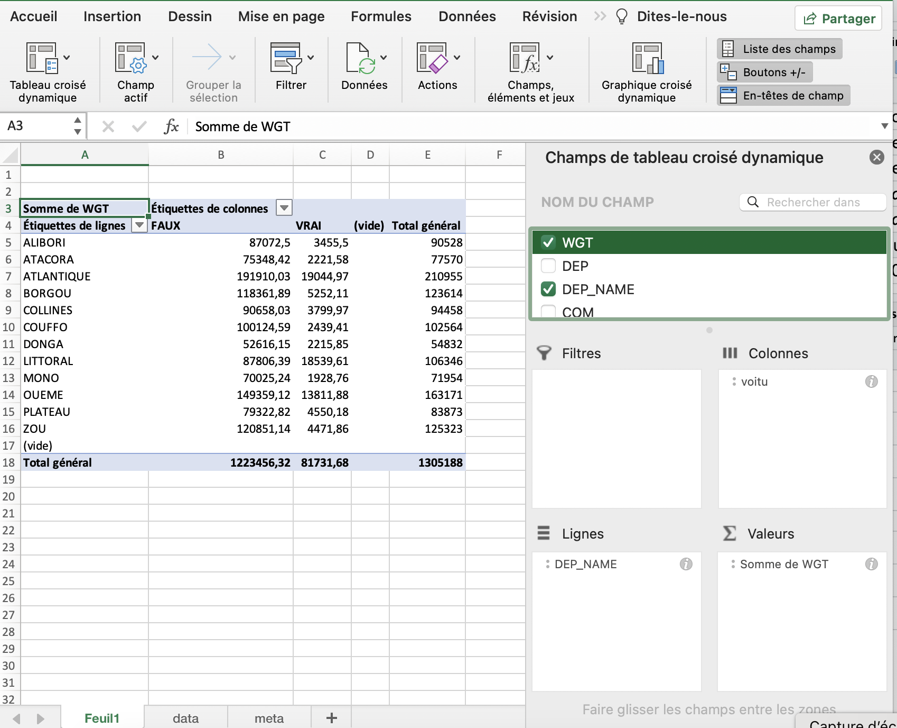

```{r setup, include=FALSE, ECHO=FALSE}
knitr::opts_chunk$set(echo = FALSE) #options générales : code invisible
library(knitr) #package de base pour Rmd
library(questionr) #package d'analyse d'enquete ajouter des pondérations 
library(officer)     #package officer
library(sf, quietly=TRUE)
library(mapsf,quietly = TRUE)
library(ggplot2)
library(gridExtra)
#library(kableExtra)
# Pour les couleurs, la palette viridis ( faciles à lire pour les personnes daltoniennes )  
library(viridis)
library(dplyr)
```


Nous allons illustrer l'usage de R markdown en prenant l'exemple de l'exploitation du recensement général de population de 2013 au Bénin. 

Le jeu de données est un échantillon de variables relatives aux ménages du Bénin lors du RP 2013. Il s'agit plus précisément d'une extraction par tirage au sort de 100 ménages dans chacun des 546 arrondissements du Bénin. Le tirage au sort a été effectué en se limitant aux ménages composés d'au moins deux personnes, dont le chef de ménage est marié ou en union libre et dont les variables chosies ne comportent pas de valeurs manquantes ou non renseignés. La base de sondage se compose donc d'1.305 millions de ménages sur les 2 millions que compte le Bénin à cette date. L'échantillon comporte exactement 54600 lignes (100 pour chacun des 546 arrondissements).

Les variables ont été anonymisées en supprimant le numéro d'identification des ménages du recensement et en le remplaçant par le code de l'arrondissement suivi d'un chiffre de 001 à 100. Les variables les plus discriminantes ont vu leur nombre de modalité réduit. 

### Importation

On importe les données depuis excel à l'aide de la fonction `read.table()` 

```{r}
# Chargement des données depuis Excel : 
don<-read.table(file = "data/BEN-MEN-2013-SAMPLE.csv",
                header = T,
                sep =";",
                dec=",",
                stringsAsFactors = TRUE) 
```


Le tableau comporte 47 variables

**STRATES**  
- ID : identifiant anonyme du ménage  
- WGT : poids du ménage  


**POSITION GEOGRAPHIQUE** 
- DEP : code du département  
- DEP_NAME : nom du département  
- COM : code de la commune  
- COM_NAME : nom de la commune  
- ARR : code de l'arrondissement  
- ARR_NAME : nom de l'arrondissement  
- URBA : statut de l'arrondissement (0 = rural, 1 = urbain)  
- DEP_CHEF : arrondissement situé au chef-lieu du département (0 = non, 1 = oui)  
- COM_CHEF : arrondissement situé au chef-lieu de la commune (0 = non, 1 = oui)  
- COM_CHEF_DIST : distance de l'arrondissement au chef-lieu de sa commune (en km)  
- DEP_CHEF_DIST : distance de l'arrondissement au chef-lieu de son département (en km)  
- NAT_CHEF_DIST : distance de l'arrondissement à l'aéroport de Cotonu (en km)  

**STRUCTURE DU MENAGE**  
- statoc : statut d'occupation (Propriété individuelle ou familiale, locataire, autre)  
- tailmen : nombre de personnes recensées dans le ménage  

**ATTRIBUTS DU CHEF DE MENAGE**   
- locnais : code de la commune de naissance (ou du département ou du pays étranger)  
- datnais : année de naissance   
- age : âge en différence de millésime  
- sexe : sexe  
- etud5 : niveau d'étude maximal (ramené à 5 modalités)  

**EQUIPEMENT DU MENAGE (présence ou absence) **   
- radio : poste de radio  
- telev : poste de télévision  
- hifi  : chaîne HIFI         
- parab : parabole  
- magne : magnetoscope  
- cddvd : lecteur de CD-DVD        
- frigo : réfrigérateur      
- cuisi : cuisinière        
- foyam : foyer aménagé        
- ferre : fer à repasser        
- clima : climatiseur        
- venti : betilateur        
- lit   : lit       
- matel : matelas       
- faumo : fauteuril moderne        
- ordi  : ordinateur       
- inter : accès internet       
- elgen : générateur électrique       
- bicyc : bicyclette       
- motoc : motcyclette       
- voitu : coiture      
- barqu : barque, pirogue       
- telfix: téléphone fixe (au moins une ligne)   
- telmob: téléphone mobile (au moins un abonnement)


**SYNTHESE DES EQUIPEMENTS**  
- equip_tot : nombre total d'équipements différents (0 à 24)  
- equip_acp : coordonnées sur le 1er axe factoriel d'une ACP sur les 24 équipements.   

Nous affichons à titre d'exemple les 5 premières lignes du tableau

```{r}
head(don)
```


### Objectif : Rapport sur l'équipement des ménages

Nous devons construire un rapport national comportant des tableaux, des graphiques et des cartes par département pour différents indicateurs d'équipement des ménages afin d'évaluer les inégalités. Le premier équipement retenu est la présence ou l'absence d'une automobile dans le ménage.


On commence par estimer le **nombre de ménages équipés au niveau de l'ensemble du pays et par département**. Nous devons pour cela construire l'équivalent d'un tableau croisée dynamique dans Excel qui aurait cette forme là :


```{r}

```

On note qu'il faudra bien pondérer les calculs par le poids des individus de l'échantillon car tous les districts n'ont pas le même nombre de ménages.


Nous allons charger le package **questionr** qui est particulièrement adapté à cette tâche puisqu'il permet de créer des tableaux pondérés avec la fonction `wtd.table()`

Le programme suivant réalise exactement la même opération que celle du tableau dynamique d'Excel, puis il affiche le résultat sous la forme d'un tableau dans le document .Rmd

```{r}
library(questionr)
tab<-wtd.table(x<-don$DEP_NAME,
               y<-don$voitu,
               weights = don$WGT,
               digits = )
kable(addmargins(tab), 
      digits=0,
      col.names = c("Non","Oui","Total"),
      caption =c("Nombre de ménages équipés en automobiles par département"))
```

On décide ensuite de calculer les pourcentages en ligne afin de connaître la part des ménages équipés d'automobile dans l'ensemble du pays ainsi que dans chaque département. 

La conversion en pct se fait en une seule ligne avec la fonction  `lprop()` - abréviation de *line proportion* - du package **questionr**. On affiche ensuite le nouveau tableau dans le document .Rmd avec un titre différent. 


```{r}
tabpct <- lprop(tab)
kable(tabpct, 
      col.names = c("Non","Oui","Total"),
      digits=1,
      caption =c("% de ménages équipés en automobiles par département"))
      
```
On peut facilement ajouter un petit commentaire, comme on le ferait dans Word. Par exemple :

- **Commentaire : ** Dans l'ensemble du Bénin, le taux d'équipement des ménages en automobile est environ de 6.3% en 2013. Cette faible proportion dissimule toutefois de fortes variations d'un département à l'autre. Dans le département du Littoral qui correspond à la métropole de Cotonou, le taux d'équipement est de 17.4%. Dans le département de Couffo qui est une zone très rurale peu développée, le taux d'équipement automobile des ménages n'est que de 2.4%. Cela fait presque un rapport de 1 à 7 !


Pour assurer une visualisation qui combine des informations issues des deux tableaux précédents, on peut utiliser la fonction générique `plot()` en l'appliquant au tableau de contingence. On raccourcit juste le nom des départements pour un meilleur affichage avec la fonction `substr()` : 

```{r}
rownames(tab)<-substr(rownames(tab),1,3)
colnames(tab)<-c("Non","Oui")
plot(tab,
     col=c("gray90","black"),
     main="Equipement des ménages en automobile par département",
     sub = "Source : RP 2013, INS Bénin"
     )
```

Cette figure est intéressante car elle permet de visualiser simultanément le poids démographique des départements (largeur des barres à la base) et la proportion de ménages disposant d'une automobile (hauteur de la barre noire). Il n'est pas possible de la produire avec Excel qui aurait besoin de deux graphiques pour exprimer à la fois le poids des départements et leur taux d'équipement. 


### Variation 1 : Cartographie

Nous disposons par ailleurs de quatre fonds de carte correspondant au découpage du Bénin à chacune des échelles d'analyse. Ils ont été convertis dans un format lisible par R à l'aide du package `sf` et permettent de faire des cartes à l'aide du package `map_sf`.

```{r}
library(sf)
library(mapsf)


BEN1<-st_read("data/BEN-ADM1.shp", quiet=T)
BEN2<-st_read("data/BEN-ADM2.shp",quiet=T)
BEN3<-st_read("data/BEN-ADM3.shp",quiet=T)
```


#### Carte administrative du Bénin

Sans avoir besoin d'utiliser un SIG, nous pouvons d'ores et déjà construire une carte présentant tous les niveaux administratifs que nous placerons en tête de notre annuaire statistique national du Bénin

```{r,fig.height=8,fig.width=6}

mf_map(BEN1, type="typo",var="DEP_NAME", leg_title = "Département")
#mf_map(BEN3, type="base",col=NA,border="white",lwd=0.1,add=T)
mf_map(BEN2, type="base",col=NA,border="black",lwd=0.5,add=T)
mf_map(BEN1, type="base",col=NA,border="black",lwd=2,add=T)
mf_layout(title = "Départements et communes du Bénin en 2013",
          credits = "Source : EE CIST 2023",frame = T,scale = T)

```

#### Carte du taux d'équipement par département

```{r}


# Charge le fonds de carte
map<-st_read("data/BEN-ADM1.shp", quiet=T)

# Ajoute les données
tab<-wtd.table(x<-don$DEP_NAME,
               y<-don$voitu,
               weights = don$WGT,
               digits = )
map$equip_nb<-tab[,2]
map$equip_pct<-lprop(tab,total=F)[,2]

# Trace la carte

## Pct d'équipement
mf_map(map, 
       type="choro",
       var="equip_pct",
       leg_pos = "right",
       leg_title = "taux d'équipement")
## Nb. de ménages équipés
mf_map(map, 
       type="prop",
       var="equip_nb",
       inches=0.1,
       leg_pos="topright",
       leg_title = "Ménages équipés")
## Cadre et titre
mf_layout(title = "Equipement des ménages du Bénin en automobile",
          credits = "Source : RP 2013, INS Bénin",
          scale = T, 
          frame=T )

```


### Variation 2 : équipement des ménages en automobile par niveau de diplôme

Au lieu de faire un calcul par département on va examiner l'effet du niveau de diplôme du chef de ménage. Nous allons ainsi pouvoir examiner les variations sociales du taux d'équipement en faisant l'hypothèse que le diplôme du chef de ménage est - en première approximation - une mesure indirecte du niveau social du ménage.  

On doit à peine modifier le programme R précédent pour construire les tableaux et figures habituels. 

```{r}
tab<-wtd.table(x<-don$etud5,
               y<-don$voitu,
               weights = don$WGT,
               digits = )

kable(addmargins(tab), 
      digits=0,
      col.names = c("Non","Oui","Total"),
      caption =c("Nombre de ménages équipés en automobile par niveau d'étude"))

tabpct <- lprop(tab)
kable(tabpct, 
      col.names = c("Non","Oui","Total"),
      digits=1,
      caption =c("% de ménages équipés en en automobile par niveau d'étude"))

rownames(tab)<-substr(rownames(tab),1,3)
colnames(tab)<-c("Non","Oui")
plot(tab,
     col=c("gray90","black"),
     main="Equipement des ménages en en automobile par niveau d'étude",
     sub = "Source : RP 2013, INS Bénin"
     )
```

- **Commentaire : ** Le taux d'équipement automobile augmente de façon pratiquement exponentielle avec le niveau de diplôme des chefs de ménages, passant de 2.5% pour les sans diplômes à 5.9% pour les diplômés du primaire, 11.3% pour ceux du secondaire et 28.0 % pour ceux du supérieur. La largeur des barres de la figure montre par ailleurs qu'il y a beaucoup de chefs de ménages sans diplômes et très peu avec un niveau universitaire.

### Variation 3 : Zoom sur un département

Nous allons maintenant reprendre nos analyses mais en prenant comme référence un département et en étudiant les variations de résultats par communes à l'intéreur de celui-ci. En terme de construction de document, cela pourrait correspondre à la rédaction d'un annuaire statistique régional reprenant les informations de l'annuaire statitique national mais de façon plus détaillée. 

En terme de programme R, on commence par sélectionner un sous-tableau relatif au département qui nous intéresse (e.g.  Borgou) puis on applique les mêmes programmes que précédemment mais en détaillant les résultats par commune et non plus par département. 

```{r}
sel<-don[don$DEP_NAME=="BORGOU",]
sel$COM_NAME<-as.character(sel$COM_NAME)
tab<-wtd.table(x<-sel$COM_NAME,
               y<-sel$voitu,
               weights = sel$WGT,
               digits = )

kable(addmargins(tab), 
      digits=0,
      col.names = c("Non","Oui","Total"),
      caption =c("Nombre de ménages équipés en automobile par communes du Borgou"))

tabpct <- lprop(tab)
kable(tabpct, 
      col.names = c("Non","Oui","Total"),
      digits=1,
      caption =c("% de ménages équipés en en automobile par communes du Borgou"))

rownames(tab)<-substr(rownames(tab),1,3)
colnames(tab)<-c("Non","Oui")
plot(tab,
     col=c("gray90","black"),
     main="Equipement des ménages en en automobile par commune du Borgou",
     sub = "Source : RP 2013, INS Bénin"
     )
```

- **Commentaire** : Le taux moyen d'équipement automobile des ménages du département de Borgou est un moins élevé (4.2%) que la moyenne du pays (6.3%). Lorsque l'on examine les résultats par commune on constate que la situation est bien meilleure dans la commune de *Parakou* (7.5%) que dans les autres communes où elle peut descendre jusqu'à 1.7% (*Sinende*). Ce résultat est logique si l'on précise que Parakou est la capitale du département de Borgou et la 2e ville du Bénin après Cotonou. 

#### Carte administrative 

Pour illustrer l'annuaire statistique régional du département de Borgou, on réalisera une carte des communes de ce département.

```{r,fig.height=6,fig.width=6}
BOR1 <- BEN1[BEN1$DEP_NAME=="BORGOU",]
BOR2 <- BEN2[BEN2$DEP_NAME=="BORGOU",]
#BOR3 <- BEN3[BEN3$DEP_NAME=="BORGOU",]

mf_map(BOR2, type="typo",var="COM_NAME", leg_title = "Communes")
#mf_map(BOR3, type="base",col=NA,border="white",lwd=0.1,add=T)
#mf_map(BOR3, type="base",col=NA,border="black",lwd=0.5,add=T)
mf_map(BOR2, type="base",col=NA,border="black",lwd=1,add=T)
mf_label(BOR2,var="COM_NAME",col = "white",cex=0.8)
mf_layout(title = "Communes du Borgou en 2013",
          credits = "Source : EE CIST 2023",frame = T,scale = T)

```

#### Carte du taux d'équipement

```{r}


# Charge le fonds de carte
map<-st_read("data/BEN-ADM2.shp", quiet=T)
map<-map[map$DEP_NAME=="BORGOU",]

# Ajoute les données
sel<-don[don$DEP_NAME=="BORGOU",]
sel$COM_NAME<-as.character(sel$COM_NAME)
tab<-wtd.table(x<-sel$COM_NAME,
               y<-sel$voitu,
               weights = sel$WGT,
               digits = )
map$equip_nb<-tab[,2]
map$equip_pct<-lprop(tab,total=F)[,2]

# Trace la carte

## Pct d'équipement
mf_map(map, 
       type="choro",
       var="equip_pct",
       leg_pos = "right",
       leg_title = "taux d'équipement")
## Nb. de ménages équipés
mf_map(map, 
       type="prop",
       var="equip_nb",
       inches=0.1,
       leg_pos="topright",
       leg_title = "Ménages équipés")
## Cadre et titre
mf_layout(title = "Equipement des ménages du Borgou en automobile",
          credits = "Source : RP 2013, INS Bénin",
          scale = T, 
          frame=T )

```


### Variation 4 : Zoom sur Cotonou

Nous allons pour finir nous centrer sur la ville capitale de Cotonou qui correspond au département du Littoral. Nous avons vu que ce département est le plus privilégié de tous, mais on peut se demander si la situation est la même dans tous les arrondissements de la ville.

```{r}
sel<-don[don$DEP_NAME=="LITTORAL",]
sel$ARR_NAME<-as.character(sel$ARR_NAME)
tab<-wtd.table(x<-sel$ARR_NAME,
               y<-sel$voitu,
               weights = sel$WGT,
               digits = )

kable(addmargins(tab), 
      digits=0,
      col.names = c("Non","Oui","Total"),
      caption =c("Nombre de ménages équipés en automobile par arrondissement de Cotonou"))

tabpct <- lprop(tab)
kable(tabpct, 
      col.names = c("Non","Oui","Total"),
      digits=1,
      caption =c("% de ménages équipés en automobile par arrondissement de Cotonou"))

rownames(tab)<-substr(rownames(tab),9,10)
colnames(tab)<-c("Non","Oui")
plot(tab,
     col=c("gray90","black"),
     main="Equipementen automobile par arrondissement de Cotonou",
     sub = "Source : RP 2013, INS Bénin"
     )
```

- **Commentaire** : Le département du Littoral est celui où les ménages sont le mieux équipés en automobiles (17.4%). Il existe toutefois des variations notables d'un arrondissement à l'autre, le maximum étant observé dans le 9e arrondissement (28%) et le minimum dans le 5e (8%). Ces valeurs demeurent dans tous les cas très élevées par rapport au reste du pays.


#### Carte administrative 

On prend enfin l'exemple de la ville de Cotonou

```{r,fig.height=4,fig.width=8}
COT1 <- BEN1[BEN1$DEP_NAME=="LITTORAL",]
COT2 <- BEN2[BEN2$DEP_NAME=="LITTORAL",]
COT3 <- BEN3[BEN3$DEP_NAME=="LITTORAL",]

mf_map(COT3, type="typo",var="ARR_NAME",leg_pos = NA)
mf_map(COT3, type="base",col=NA,border="white",lwd=0.1,add=T)
mf_map(COT3, type="base",col=NA,border="black",lwd=0.5,add=T)
mf_map(COT2, type="base",col=NA,border="black",lwd=2,add=T)
mf_label(COT3,var="ARR_NAME",col = "white",cex=0.6)
mf_layout(title = "Arrondissements de Cotonou en 2013",
          credits = "Source : EE CIST 2023",frame = T,scale = T)

```


#### Carte du taux d'équipement

```{r}


map<-COT3

# Ajoute les données
sel<-don[don$DEP_NAME=="LITTORAL",]
sel$ARR_NAME<-as.character(sel$ARR_NAME)
tab<-wtd.table(x<-sel$ARR_NAME,
               y<-sel$voitu,
               weights = sel$WGT,
               digits = )
map$equip_nb<-tab[,2]
map$equip_pct<-lprop(tab,total=F)[,2]

# Trace la carte

## Pct d'équipement
mf_map(map, 
       type="choro",
       var="equip_pct",
       leg_pos = "right",
       leg_title = "taux d'équipement")
## Nb. de ménages équipés
mf_map(map, 
       type="prop",
       var="equip_nb",
       inches=0.1,
       leg_pos="topright",
       leg_title = "Ménages équipés")
## Cadre et titre
mf_layout(title = "Equipement des ménages de Cotonou en automobile",
          credits = "Source : RP 2013, INS Bénin",
          scale = T, 
          frame=T )

```


