```{r setup, include=FALSE, ECHO=FALSE}
knitr::opts_chunk$set(echo = FALSE) #options générales : code invisible
library(knitr) #package de base pour Rmd
library(questionr) #package d'analyse d'enquete ajouter des pondérations 
library(officer)     #package officer
library(sf, quietly=TRUE)
library(mapsf,quietly = TRUE)
library(ggplot2)
library(gridExtra)
#library(kableExtra)
# Pour les couleurs, la palette viridis ( faciles à lire pour les personnes daltoniennes )  
library(viridis)
library(dplyr)
```


## Téléphone mobile


```{r}


# Chargement des données depuis Excel : 
don<-read.table(file = "data/BEN-MEN-2013-SAMPLE.csv",
                header = T,
                sep =";",
                dec=",",
                stringsAsFactors = TRUE) 
# Choix de l'équipement
don$equip<-don$telmob

# Recodage de la variable URBA
don$URBA<-as.factor(don$URBA)
levels(don$URBA) <- c("Rural","Urbain")

# Sélection des variables
don<-don[,c("ID","WGT","DEP_NAME","URBA","age","sexe","etud5","equip")]
```


#### <span style="color:darkorange">Présentation de l'équipement</span>: 

```{r,fig.cap="Exemple de téléphone mobile"}


```

Le téléphone mobile en Afrique ne se limite pas à être un simple moyen de communication. Il sert également d'outil de travail, de gestion des transactions financières, de source de divertissement, et bien plus encore. Dans des pays tels que le Sénégal ou le Kenya, on observe, par exemple, des agriculteurs et des fermiers qui utilisent les SMS pour consulter les prix des denrées alimentaires avant de finaliser une transaction avec un intermédiaire.[@OrangeMEA]
Nous allons nous intéresser lors de notre étude à l'équipement en Téléphonie mobile au Bénin en 2013 et nous tâcherons d'identifier les facteurs d'adoption sociaux et spaciaux de cet instrument. 

#### <span style="color:green">Taux global d'équipement :</span> 

```{r}
knitr::opts_chunk$set(echo = FALSE) #options générales : code invisible
# Création d'une table pondérée (tab1) à partir du vecteur d'équipement (don$equip)
# en utilisant les poids spécifiés dans don$WGT. La précision des chiffres après la virgule est fixée à 1 avec l'argument digits.

tab1<-wtd.table(x=don$equip,    
               weights = don$WGT, 
               digits=1)
# Création d'une table de fréquences (tab1pct) à partir de la table pondérée (tab1)

tab1pct <- freq(tab1, digits=1) 
kable(tab1pct,digits = 1,col.names = c("Nb","%","%val"))

```
Une proportion remarquable de 80.4% des ménages[^1] étaient détenteurs de téléphones mobiles en 2013. Cette statistique suggère une adoption généralisée de cet équipement, soulignant ainsi l'importance croissante des téléphones mobiles dans le quotidien des ménages béninois.

[^1]: On ne considère ici que les ménages comportant deux personnes vivant en couple


### <span style="color:darkorange">Inégalités sociales :</span> 

#### <span style="color:green">L'effet du niveau d'éducation :</span>  

```{r}
knitr::opts_chunk$set(echo = FALSE) #options générales : code invisible
tab2<-wtd.table(x=don$etud5,
               y=don$equip,
               weights = don$WGT, 
               digits=0)
proportions <- lprop(tab2)
# Afficher les proportions sous forme de tableau avec kable
kable(proportions, digits = 1, 
      col.names = c("Non-équipé","équipé","tot"), caption = "Equipement en Téléphones Mobiles en fonction du niveau d'études")
```
Ce tableau représente les pourcentages d'équipement en téléphone mobile en fonction du niveau d'étude au prés des ménages béninois. 
La tendance générale indique que l'équipement en téléphone mobile augmente à mesure que le niveau d'éducation augmente. Les pourcentages d'équipement augmentent de manière significative passant des niveaux d'éducation les plus bas (Aucun, Primaire) aux niveaux d'éducation plus élevés (Secondaire, Supérieur), nous illustrons ce phénomène d'avantage à l'aide du graphique suivant : 
```{r}
knitr::opts_chunk$set(echo = FALSE) #options générales : code invisible
couleurs <- c("palegoldenrod", "orangered")

# Afficher le graphique avec des couleurs
plot(tab2, 
     main = "Equipement en Téléphones Mobiles en fonction du niveau d’études",
     sub = "Source : RP 2013, INS Bénin",
     col = couleurs)
```

#### <span style="color:green">L'effet de l'âge du chef de ménage :</span> 

```{r}
knitr::opts_chunk$set(echo = FALSE) #options générales : code invisible
ageintervall <- cut(don$age, breaks = c(18, 35,60, 99), labels = c("Jeunes", "age moyen", "sénior"))
tab22<-wtd.table(y=don$equip,
               x=ageintervall,
               weights = don$WGT, 
               digits=0)
proportions1 <- lprop(tab22)

# Afficher les proportions sous forme de tableau avec kable
kable(proportions1, digits = 1,col.names = c("Non-équipé","équipé","tot"), caption = "Equipement en téléphone mobiel en fonction de l'age du chef de ménage")

```
Afin d'étudier l'effet de l'age nous avons divisé la population en trois catégories d'âge du chef de ménage : jeunes (18 à 35 ans), âge moyen (35 à 60 ans) et sénior (60 ans et plus). L'analyse révèle que les jeunes affichent le pourcentage le plus élevé d'individus équipés (82.4%), suivi de près par le groupe d'âge moyen (81.2%). Les chefs de ménage seniors ont une proportion d'individus équipés plus basse (69.0%), suggérant une adoption légèrement moindre de la technologie mobile dans cette tranche d'âge.

### <span style="color:darkorange">Inégalités spatiales :</span> 

#### <span style="color:green">L'opposition rural-urbain :</span> 

```{r}
knitr::opts_chunk$set(echo = FALSE) #options générales : code invisible
tab4<-wtd.table(x=don$URBA, y=don$equip,
               weights = don$WGT, 
               digits=0)
proportions2 <- lprop(tab4)
kable(proportions2, digits = 1,col.names = c("Non-équipé","équipé","tot"), caption = "Equipement en Téléphone mobile dans les zones rurales et urbaines")

```


#### <span style="color:green">Inégalités départementales :</span> 

```{r}
knitr::opts_chunk$set(echo = FALSE) #options générales : code invisible
tab3<-wtd.table(x=don$DEP_NAME,
               y=don$equip,
               weights = don$WGT, 
               digits=0)
proportions3 <- lprop(tab3)
kable(proportions3, digits = 1,col.names = c("Non-équipé","équipé","tot"), caption = "Equipement en Téléphone mobile par département")
```
Ce tableau représente l'équipement des ménges béninois en Téléphones mobiles par département;les variations dans les taux d'équipement entre les départements soulignent des disparités régionales dans l'adoption de la technologie mobile. En effet les départements du littoral et de l'Ouémé se distinguent par des taux d'équipement élevés, tandis que le Couffo et l'Atacora ont des taux plus bas.
Ces résultats peuvent refléter des différences économiques, démographiques ou d'infrastructure entre les départements, soulignant l'importance de considérer les contextes locaux dans les analyses relatives à l'équipement en téléphonie mobile.

### <span style="color:darkorange"> Carte illustrant les la distribustion d'utilisation des téléphones mobiles au Bénin :</span>

```{r}
knitr::opts_chunk$set(echo = FALSE) #options générales : code invisible
# Installe les packages de cartogaphie
library(sf, quietly=T)
library(mapsf,quietly = T)

# Charge le fonds de carte
map<-st_read("data/BEN-ADM1.shp", quiet=T)

# Ajoute les données
map$equip_nb<-tab3[,2]
map$equip_pct<-lprop(tab3,total=F)[,2]

# Trace la carte

## Pct d'équipement
mf_map(map, 
       type="choro",
       var="equip_pct",
       leg_pos = "right",
       leg_title = "taux d'équipement")
## Nb. de ménages équipés
mf_map(map, 
       type="prop",
       var="equip_nb",
       inches=0.1,
       leg_pos="topright",
       leg_title = "Ménages équipés")
## Cadre et titre
mf_layout(title = "Equipement du Bénin en Téléphone mobile",
          credits = "Source : RP 2013, INS Bénin",
          scale = T, 
          frame=T )

```

### <span style="color:darkorange"> Conclusion :</span> 
Cette étude exhaustive sur l'équipement en téléphone mobile au Bénin fournit des insights significatifs sur les tendances et les disparités dans l'adoption de cette technologie au sein de la population. En divisant la population en différentes catégories telles que le niveau d'éducation, l'âge du chef de ménage, et les départements, nous avons pu identifier des informations intéressantes. L'étude offre une base solide pour comprendre les dynamiques de l'équipement en téléphone mobile au Bénin. Ces résultats peuvent orienter les décideurs, les entreprises et les organisations vers des politiques et des initiatives plus ciblées visant à améliorer l'accès et l'utilisation des technologies mobiles, contribuant ainsi au développement socio-économique global du pays.

### <span style="color:darkorange"> Bibliographie :</span> 

[@OrangeMEA]

## Télévision

```{r}
# Chargement
don<-read.table(file = "data/BEN-MEN-2013-SAMPLE.csv",
                header = T,
                sep =";",
                dec=",",
                stringsAsFactors = TRUE)

# Choix de l'équipement
don$equip<-don$telev

# Recodage de la variable equip
don$equip<-as.factor(don$equip)
levels(don$equip) <- c("Non équipé","Equipé")

# Recodage de la variable URBA
don$URBA<-as.factor(don$URBA)
levels(don$URBA) <- c("Rural","Urbain")

#Création de classes d'âge
#summary(don$age)
don$age4 <- cut(don$age, breaks=c(18,32,40,50,100))


# Sélection des variables
don<-don[,c("ID","WGT","DEP_NAME","URBA","age4","sexe","etud5","equip")]

```


### Introduction


```{r,out.width="60%",fig.align="center",fig.cap="Exemple de Télévision"}

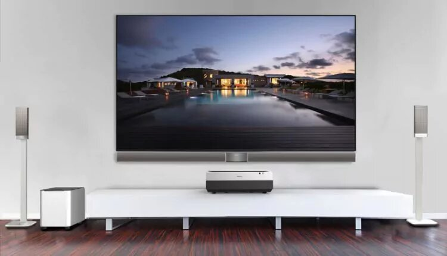
```


&nbsp;&nbsp;&nbsp;&nbsp; L'accès à la télévision a traditionnellement été interprété comme un marqueur de croissance économique et de développement de la consommation des masses à l'ère contemporaine [@matsuyama_rise_2002]. De ce fait, l'étude de ce produit peut apporter des éléments d'analyse pertinents pour évaluer la situation socio-économique des ménages béninois. 

&nbsp;&nbsp;&nbsp;&nbsp; Dans un contexte de mondialisation croissante, le continent africain suscite l'intérêt des experts, car il fait désormais partie des [perspectives de développement au XXIe  siècle](https://foreignpolicy.com/2022/05/13/africa-century-economic-growth/). Or, la persistance de fortes inégalités sociales et territoriales, tend à nuancer l'optimisme de ce récit [@giovalucchi]. 

&nbsp;&nbsp;&nbsp;&nbsp; À l'aune de ces considérations, ce chapitre vise à mettre en exergue certaines disparités sociospatiales concernant l'équipement en télévision des ménages béninois à partir des données du recensement du Bénin de 2013 réalisé par l'INS (Institut National de la Statistique).

&nbsp;&nbsp;&nbsp;&nbsp; Dans un premier temps, nous allons considérer l'analyse de deux variables sociales particulièrement pertinentes pour l'avenir du continent le plus jeune du monde: l'éducation et l'âge de la population[^2]. Deuxièmement, le creusement des inégalités territoriales en Afrique implique une croissance économique très inégalement répartie selon la typologie des espaces. Sous ce prisme,  nous essayerons de distinguer la diversité des situations existantes dans les espaces urbains et ruraux du pays, ainsi que dans ses différents départements. 

[^2]: Les Nations Unies ont reconnu l'accès à l'éducation comme un [axe d'action prioritaire](https://www.un.org/fr/impact-universitaire/education-pour-tous#:~:text=L'%C3%A9ducation%20est%20la%20composante,droit%20%C3%A0%20l'%C3%A9ducation%20%C2%BB.) pour le développement des sociétés humaines.  


### Résultats généraux

#### Taux global d'équipement

```{r}
tab1<-wtd.table(x=don$equip,
               weights = don$WGT, 
               digits=1)
freq(tab1)

```

&nbsp;&nbsp;&nbsp;&nbsp; Concernant le taux global d'équipement, on constate que seulement environ un tiers des ménages[^1] du Bénin possédait une télévision en 2013. Ce taux demeure largement en dessous de la moyenne des pays développés[^31]. Néanmoins, ce chiffre n'a pas de valeur explicative dans la mesure où elle dissimule de fortes variations sociospatiales. 


[^31]: Le Conseil Supérieur de l'Audiovisuel constatait un [taux de pénétration de 91,7%](https://www.csa.fr/Informer/Collections-du-CSA/Panorama-Toutes-les-etudes-liees-a-l-ecosysteme-audiovisuel/Les-observatoires-de-l-equipement-audiovisuel/L-equipement-audiovisuel-des-foyers-aux-3e-et-4e-trimestres-2020-pour-la-television-et-de-l-annee-2020-pour-la-radio) des foyers français en 2020. 


### Inégalités sociales

#### L'effet du niveau d'éducation

```{r,out.width="70%"}
tab2<-wtd.table(x=don$etud5,
               y=don$equip,
               weights = don$WGT, 
               digits=0)
tab3 <- lprop(tab2)
kable(tab3, digit=2,
      caption="La répartition des télévisions en fonction du niveau d'études", 
      col.names = c("Non équipé","Equipé","Total"))
```


```{r,out.width="60%"}
plot(tab2, 
     main="L'équipement selon le niveau d'études",
     sub = "Source : RP 2013, INS Bénin",
     col = c("darkblue","lightblue"))
```


&nbsp;&nbsp;&nbsp;&nbsp;  Comme prévu, l'analyse du niveau d'études des ménages béninois a dévoilé l'existence d'un écart favorable aux catégories éduquées. Même si le décalage est suffisamment marquant lorsqu'on compare le taux d'équipement des cohortes sans études (16%) avec celui des ménages ayant suivi une éducation primaire (41%), le fossé ne cesse de se creuser au fur et à mesure que le niveau éducatif augmente, en atteignant un taux de plus de 83% dans les couches supérieures. Cette évolution confirme le potentiel de l'éducation comme une voie d'accès à de meilleures opportunités socioéconomiques.


#### L'effet de l'âge du chef de ménage


```{r,out.width="70%"}
tab4 <-wtd.table(x=don$age4,
               y=don$equip,
               weights = don$WGT, 
               digits=0)

tab5 <- lprop(tab4)

kable(tab5, digit=2,
      caption="La répartition des télévisions selon l'âge du chef de ménage",
      col.names = c("Non équipé","Equipé","Total"))

```


&nbsp;&nbsp;&nbsp;&nbsp; Contrairement à la variable précédente, l'âge du chef de ménage ne semble pas être déterminant dans la répartition. En effet, le taux d'équipement demeure relativement uniforme parmi les catégories d'age en dessous de 50 ans, en oscillant entre 33 et 36% dans tous les cas. En revanche, les générations les plus âgées ne parviennent pas à dépasser le seuil du 30%. [^4].

[^4]: Cependant, il faut considérer que la structure démographique du pays conduit à une surreprésentation des jeunes dans sa [pyramide de population](https://perspective.usherbrooke.ca/bilan/servlet/BMPagePyramide?codePays=BEN), ce qui explique le poids de ces groupes dans la pondération finale.


### Inégalités spatiales


#### L'opposition rural-urbain

```{r,out.width="70%"}

tab6 <-wtd.table(x=don$URBA,
               y=don$equip,
               weights = don$WGT, 
               digits=0)
tab7 <- lprop(tab6)

kable (tab7, digit=2,
       caption="L'écart entre les territoires ruraux et urbains",
       col.names = c("Non équipé","Equipé","Total"))

```

```{r}

```

#### Inégalités départementales

```{r, out.width="60%"}
tab8 <- wtd.table(x=don$DEP_NAME,
               y=don$equip,
               weights = don$WGT, 
               digits=0)

tab9 <- lprop (tab8)


##Carte
# Installe les packages de cartogaphie
library(sf, quietly=T)
library(mapsf,quietly = T)

# Charge le fonds de carte
map<-st_read("data/BEN-ADM1.shp", quiet=T)

# Ajoute les données
map$equip_nb<-tab8[,2]
map$equip_pct<-lprop(tab8,total=F)[,2]

# Trace la carte

## Pct d'équipement
mf_map(map, 
       type="choro",
       var="equip_pct",
       leg_pos = "right",
       leg_title = "taux d'équipement")
## Nb. de ménages équipés
mf_map(map, 
       type="prop",
       var="equip_nb",
       inches=0.1,
       leg_pos="topright",
       leg_title = "Ménages équipés")
## Cadre et titre
mf_layout(title = "Equipement des ménages béninois en télévision",
          credits = "Source : RP 2013, INS Bénin",
          scale = T, 
          frame=T )


```


&nbsp;&nbsp;&nbsp;&nbsp; L'analyse territoriale effectuée corrobore l'ampleur des écarts entre les régions urbaines (avec un taux d'équipement supérieur à 50%) et rurales (inférieur à 25%). Parallèlement, les chiffres les plus élevés se concentrent autour de la capitale et les départements frontaliers situés dans le littoral sud-est, correspondant aux territoires les plus densément peuplés du pays. En dehors de ce pôle, ce sont les départements de Borgou et Donga (avec les agglomérations urbaines de Parakou et Djougou, respectivement) qui présentent les concentrations les plus importantes des ménages équipés.

### Conclusion

&nbsp;&nbsp;&nbsp;&nbsp; L'analyse actuelle est révélatrice des disparités structurelles concernant l'équipement des ménages béninois. Une population majoritairement urbaine, bénéficiant de son accès au circuit éducatif et à la consommation des biens et des services, connaît un niveau d'équipement largement supérieur à celui des populations rurales et peu éduquées. Malgré une croissance économique future, la cristallisation de cette métropolisation pourrait mener au renforcement des inégalités au sein du pays [@gabriel2010].

## Motocyclettes

```{r}
# Chargement des données
don<-read.table(file = "data/BEN-MEN-2013-SAMPLE.csv",  # Spécifions le chemin d'accès au fichier CSV
                header = T,  # Indiquons que la première ligne du dataset contient les noms de colonnes
                sep =";", # Le séparateur de champ dans le fichier CSV est le point-virgule
                dec=",",  # Le séparateur décimal est la virgule
                stringsAsFactors = TRUE) # Les chaînes de caractères doivent être traitées comme des facteurs afin de faciliter la manipulation, les analyses ainsi que la visualisation statistiques


# Selectionnons les variables pertinentes pour l'objet de ce chapitre
don<-don[,c("ID","WGT","DEP_NAME","sexe","motoc")]
```

```{r, fig.cap=" Béninois en motocyclette à Bohicon dans le département du Zou", out.width="50%", out.height="50%", fig.align='center'}
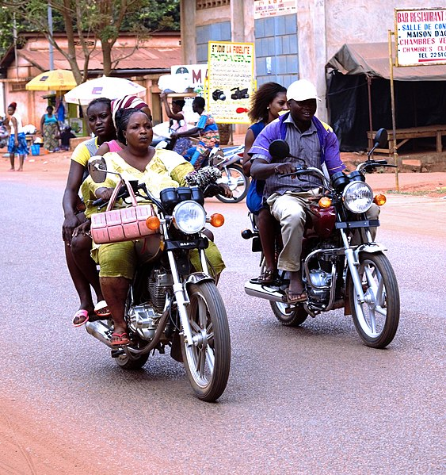 # Béninois en motocyclette à Bohicon dans le département du Zou
```

### Introduction  

Inventée en 1868 par l'ingénieur français Louis-Guillaume Perreaux, la motocyclette a ensuite été commercialisée pour la première fois en 1899 par les frères Wagner qui lui en attribuèrent le nom.

La motocyclette s'est rapidement répandue sur tous les continents, y compris en Afrique. En effet, elle apporte une réponse aux problèmes de mobilité des populations en raison d'un difficile accès aux véhicules privés, de l'insuffisance des transport public et des routes en mauvais état. L'utilisation des motocyclettes est omniprésente au Bénin. Pour un usage privé ou professionnel, notamment à travers les motos-taxis appelées *Zemidjan*, signifiant "emmène-moi". Il s'agit donc d'un équipement intéressant à étudier pour pouvoir observer les inégalités au sein du pays.

Dans le cadre de ce chapitre, nous étudierons le taux d'équipement en motocyclette sur la base d'un échantillon de variables relatives aux ménages du Bénin lors du recensement de la population en 2013 (RP 2013). Il s'agit plus précisément d'une extraction par tirage au sort de 100 ménages dans chacun des 546 arrondissements du Bénin. Nous ne considérerons que les ménages composés d'au moins deux personnes vivant en couple, et enfin le sexe du ménage est attribué à son chef.

Afin d'avoir une vue d'ensemble sur le sujet, nous étudierons dans un premier temps le taux d'équipement en motocyclette de la population du Bénin. Dans un deuxième temps, nous changerons d'échelle afin d'étudier les inégalités spatiales à travers le taux d'équipement des ménages par département. Et enfin, dans un troisième temps, pour illustrer les inégalités sociales, nous étudierons les inégalités d'équipement en motocyclette entre les hommes et les femmes.


### I. Le taux global d'équipement en motocyclette au Bénin
Nous analyserons dans cette section le taux d'équipement global des ménages au Bénin en 2013.

```{r, tableau1, fig.align='center', results='asis'}

# Calculons le nombre général de ménages équipés en motocyclette
tab1<-wtd.table(x=don$motoc,
               weights = don$WGT, 
               digits=1)

# Mettons tab1 sous forme de pourcentage.
tab1pct<-prop.table(tab1)*100

# Renommons les noms de lignes.
rownames(tab1pct)<-c("Non équipé","Équipé")


# Et enfin créons un tableau.
tableau1 <- kable(addmargins(tab1pct), 
                  digits = 1,
                  caption = c("Taux d'équipement global en motocyclette au Bénin"),
                  col.names = c("Possession de motocyclette","Pourcentage (%)"))

tableau1
```
Source : RP 2013, INS Bénin


On constate une répartition équilibrée entre les ménages possédant une motocyclette et ceux qui n'en possèdent pas. En effet, **52.1% des ménages possèdent une motocyclette tandis que 47.9% des ménages n'en possèdent pas en 2013.**


### II. Les inégalités spatiales
Nous analyserons dans cette section le taux d'équipement en motocyclette par département. Dans le but d'avoir une analyse plus précise et pouvoir nuancé le constat fait à l'échelle du pays. 
```{r, tableau2}
# Calculons le nombre de ménages équipés  par département en prenant en compte le poids des ménages.
tab2<-wtd.table(x=don$DEP_NAME,
               y=don$motoc,
               weights = don$WGT, 
               digits=0)

# Mettons tab2 sous forme de pourcentage.
tab2pct<-lprop(tab2)


# Ajoutons des noms de colonnes.
colnames(tab2pct)<-c("Non équipé (%) ","Équipé (%)","Total (%)")

# Affichons le tableau.

tableau2 <- kable(tab2pct, 
                  digits = 1,
                  caption = c("Taux d'équipement en motocyclette par département"))
tableau2
```
Source : RP 2013, INS Bénin


```{r, graphique1, fig.align='center'}
# Ajoutons un graphique.

### Afin de pouvoir rendre le graphique lisible nous utiliserons seulement les trois premières lettres pour chaque département.
rownames(tab2)<-substr(row.names(tab2),1,3)

### Modifions les noms de colonnes
pct2<-lprop(tab2,total=FALSE) # Ne pas faire apparaitre le total
colnames(pct2)<-c("Non équipé (%) ","Équipé (%)")

### Codons le graphique, en y ajoutant le titre et la source

plot(pct2,
     col=c("skyblue","steelblue"), # Ajoutons les couleurs
     main="Taux d'équipement en motocyclette par département au Bénin",# Ajoutons le titre
     sub="Source : RP 2013, INS Bénin") # Ajouter la source


```


Nous observons des disparités plus marquées, en analysant le taux d'équipement par département. En effet, on retrouve **dans le département de Borgou le taux d'équipement le plus élevé qui est de 62.4%, tandis qu'il est de 32.1% dans le département de Mono**. Cela peut s'expliquer par le fait que Borgou et Mono font partie des départements où le revenu des ménages est le plus polarisé. Toutefois, nous constatons que la majorité des départements (8 sur 12) ont un taux d'équipement en motocyclette qui dépasse les 50% et qui n'excède pas 60% excepté Borgou. En cela nous retrouvons l'observation faite à l'ensemble du pays.


### III. Les inégalités sociales
Dans cette section, nous analyserons les disparités dans l'équipement en motocyclette entre les sexes. Des inégalités affectant la vie quotidienne des Béninois.


```{r tableau3}
# Calculons le taux d'équipement par sexe en prenant en compte le poids des ménages
tab3<-wtd.table(x=don$sexe,
               y=don$motoc,
               weights = don$WGT, 
               digits=1)

tab3pct<-lprop(tab3) # Ajoutons les %
 
colnames(tab3pct)<-c("Non équipé (%)","Équipé (%)","Total (%)") # Renommons les colonnes
rownames(tab3pct)<-c("Féminin","Masculin","Total") # Renommons les lignes

tableau3<-kable(tab3pct,
                digits=1, # Mettons un chiffre après la virgule
                caption=c("Taux d'équipement en motocyclette par sexe")) # Ajoutons un titre
tableau3
```
Source: RP 2013, INS Bénin


```{r,fig.align='center'}

pct3<-lprop(tab3,total=FALSE) # nous voulons les données en % sans le total

colnames(pct3)<-c("Non équipé","Équipé") # Renommons les colonnes
# Créons un graphique en utilisons la fonction text ce qui nous permettra de faire apparaitre plus facilement les %
text(
  x = barplot(pct3,
              beside = TRUE, # mettons les barres à cotés
              col = c("skyblue","steelblue"), # les couleurs
              ylim=c(0,100), # l'intervalle de l'axe des ordonnées
              main=c("Taux d'équipement par sexe"), # le titre
              sub=c("Source : RP 2013, INS Bénin"), # la source
              legend.text=c("Feminin","Masculin")), # la légende
  y = pct3 + 3, # endroit ou l'on ajoute les %
  labels = paste(round(pct3,1), "%"), # les % à afficher
  pos = 3, # plaçons les au centre
  col = "black", # couleur des %
  cex = 0.8) # taille du texte
```
Le taux d'équipement en motocyclette chez les hommes chefs de ménage est relativement équilibré, avec **58.4% des hommes équipés et 41.6% des hommes non équipés**. En revanche, chez les femmes il existe une grande disparité, avec seulement **18.7% des femmes qui sont équipées contre 81.3% des femmes non équipées**. Cette inégalité peut avoir des conséquences sur l'accès aux soins, en particulier dans les situations d'urgence telles que les accidents routiers fréquents au Bénin ou encore les cas de césariennes. Cette inégalité peut s'expliquer par des normes sociales qui associent généralement la conduite de motocyclettes au sexe masculin. Ces attentes sociales peuvent ainsi dissuader les femmes de conduire, en plus des remarques décourageantes.

### Conclusion
À l'échelle du pays et à l'échelle départementale, la répartition entre ménages équipés et non équipés en motocyclette est relativement équilibrée, mais les inégalités deviennent très fortes lorsqu'on compare le taux d'équipement des femmes à celui des hommes.

### Bibliographie motocyclette

* "La motocyclette dans tous ses états en Afrique ", Beitragsaufruf, Calenda, Veröffentlicht am Dienstag, 09. Februar 2021, https://calenda.org/839611
* "Inégalités et Polarisation des reveus des ménages au Bénin", United Nations Development Program, https://www.undp.org/sites/g/files/zskgke326/files/migration/bj/e0e3c1a01557e2e2e0b9fa3b7e7d3669207966e0297c0068fd8f3ab2f15c74ac.pdf


## Ordinateurs

```{r, include=FALSE, echo=FALSE}

# Chargement du doc Bénin
benin_tab<-read.table(file = "data/BEN-MEN-2013-SAMPLE.csv",
                header = T,
                sep =";",
                dec=",",
                stringsAsFactors = TRUE)

# Choix de l'équipement
benin_tab$equip<-benin_tab$ordi

# Recodage de la variable URBA
benin_tab$URBA<-as.factor(benin_tab$URBA)
levels(benin_tab$URBA) <- c("Rural","Urbain")

# Sélection des variables : avec Internet, Electricité, Proprio ou locataire
benin_tab<-benin_tab[,c("ID","WGT","DEP_NAME","URBA","age","sexe","etud5","equip", "elgen", "inter", "statoc")]
```

### Introduction

<p style="text-align:justify;">
"Transformer le Bénin en une plateforme de services numériques pour l’Afrique de l’ouest", voici l'ambition du [Ministère du Numérique et de la Digitalisation](https://numerique.gouv.bj/le-secteur/reformes). Cet objectif s'inscrit dans la croissance économique du pays et se traduit par une réelle volonté de placer le numérique au cœur de son organisation. \ Pour accomplir l'évolution du système éducatif ou de l'approche des démarches administratives des ménages, la condition de l'accès à ces technologies se pose. Malgré la présence de géant de l'informatique avec IBM et Compaq et d'industrie locale tel Master Soft[@Univ_montreal], la distribution de ces outils reste concentrée et très peu équitable. [@illustration_ordi]
<p>


```{r fig.align='center', out.width="55%"}

# Afficher une image centré sur le document - NE PAS AFFICHER CAR MANQUE DE PLACE EN WORD
#include_graphics("img/ordinateur_pinterest.jpg")

```


<center>
```
Dès lors, on peut s'interroger sur l'impact de la répartition des ordinateurs en tant que marqueur d'inégalité.
```
</center>


Au sein de ce dossier, les analyses et calculs effectués se baseront sur le recensement des ménages du Bénin en 2013. Avec près de 2 millions de ménages, le sondage du recensement s'appuie sur différents critères[^21] afin d'affiner les résultats pour permettre une étude plus harmonieuse. Ainsi, un échantillon représentatif de 54 600 ménages sera pris en compte, où chacun aura un "poids", qui diffère d'une région à l'autre[^32].  


[^21]: Seuls les ménages d'au moins deux personnes, dont le chef de ménage est marié ou en union libre et où toutes les informations demandées sont présentes, ont été sélectionnés.

[^32]: Il existe 546 arrondissements sur le territoire béninois ; pour chacun, 100 ménages ont été tirés au sort. Pour rendre cet échantillon représentatif, il se doit d'être ajouté un coefficient appelé "poids" en fonction du nombre de ménage total par arrondissement.

### L'aménagement national : une première approche du problème

```{r}
# Nombre de ménage possédant ou non un ordinateur - Calcul pondéré
ordinateur<-wtd.table(x<-benin_tab$equip,
                      weights = benin_tab$WGT,
                      digits = 0)

kable(freq(ordinateur, 
           digits = 0),
      col.names = c(" ", " Nombre de ménage", "Pourcentage", "Pourcentage cumulé"),
      align = 'c')
```

<p style="text-align:justify;">
Ce tableau souligne notre première hypothèse : l'accès aux ordinateurs est chose rare. Sur les 1.3 millions de ménages présents sur le territoire, seulement 5% d'entre eux sont équipés soit moins de 62 100 ménages. Nous allons donc chercher une (ou plusieurs) cause pouvant expliquer cette divergence.
<p>

---

<p style="text-align:justify;">
De cette manière, nous chercherons à savoir si [les inégalités sont réparties de façon équitable sur l'ensemble du territoire](#partie1). Cette première approche nous permettra d'étudier deux facteurs sociaux pouvant être cause d'inégalité : [le sexe du chef de ménage](#partie2-01) ainsi que [son niveau d'étude](#partie2-02).
<p>

### <a id="partie1">La répartition des inégalités : un point de vue spatial </a>

```{r fig.height=1, fig.width=3}
# Répartition des ordinateurs par département - Calcul pondéré
ordinateur_par_departement<-wtd.table(x = benin_tab$DEP_NAME,
                                      y = benin_tab$equip, 
                                      weights = benin_tab$WGT)

# Affichage (avec le total) du tableau de répartition ci-dessus
#kable(addmargins(ordinateur_par_departement),
#      digits = 0,
#      col.names = c("ABSENCE", "PRESENCE", "TOTAL"))

# Affichage des pourcentages du tableau par département
kable(lprop(ordinateur_par_departement),
      digits = 2,
      col.names = c("ABSENCE", "PRESENCE", "TOTAL"),
      caption = "Le pourcentage d'équipement en ordinateur au sein des ménages")
```

<p style="text-align:justify;">
Au travers de ce tableau, on observe la répartition géographique de l'aménagement en ordinateur. Avec plus de 17% en son sein, *le Littoral est le département le mieux équipé* ; cela peut s'expliquer par la présence de **Cotonou**, capitale économique et plus grande ville du pays. Suivi par *l'Atlantique* et le *Ouémé*, respectivement 8% et 5%, on remarque que ces trois départements se situent sur la **région Sud du Bénin**, régions côtières.
<p>


```{r fig.align='center', out.width="50%"}
# Formater les noms des colonnes et des lignes
rownames(ordinateur_par_departement)<-substr(rownames(ordinateur_par_departement),1,3)
colnames(ordinateur_par_departement)<-c("Non","Oui")

# Création du graphique de répartition par département
plot(ordinateur_par_departement,
     main = "Equipement des ménages par département",
     col = c("#F3F6FE", "#4874EE"))
```

<p style="text-align:justify;">
Confirmant notre idée citée plus haut, le Littoral, l'Atlantique et l'Ouémé prédominent sur l'aménagement des ménages avec de forts écarts entre le reste du territoire. Malgré la population importante de l'Atlantique (plus grande population du pays), le Littoral est mieux équipé : cela peut traduire un meilleur niveau de vie des ménages ou un besoin plus important de cet équipement.
<p>

### <a id="parite2-00">Inégalités sociales </a>

#### <a id="partie2-01">L'effet du sexe sur l'accès aux ordinateurs </a>

```{r fig.align='center', fig.height=1, fig.width=3}
# Tableau relié au Sexe du chef de ménage
tab6 <- wtd.table(benin_tab$sexe, 
                  benin_tab$equip,
                  weights = benin_tab$WGT,
                  digits = 1)

# Renommer colonnes et lignes
rownames(tab6)<-c("Femme", "Homme")
colnames(tab6)<-c("Sans", "Avec")

# Afficher tableau avec totaux
kable(addmargins((tab6)),
      digits = 0)
```

<p style="text-align:justify;">
En tant qu'indicateur social, nous choisissons dans un premier temps : le sexe. La différence d'équipement en ordinateur se fait beaucoup ressentir : 10 fois plus d'hommes ont un ordinateur que de femme[^41]. Néanmoins, on observe que la population béninoise est majoritairement composée d'homme, alors ce marqueur social est-il suffisant pour expliquer une telle inégalité ?
<p>

[^41]: On évoque le sexe en tant qu'identité du chef de ménage.

#### <a id="partie2-02"> L'effet du niveau d'éducation </a>{.tabset}

>Mais alors : quel marqueur pourrait expliquer ces inégalités ? 

<p style="text-align:justify;">
Supposons que dans un pays en développement, l'utilisation d'un ordinateur nécessite des compétences avancées. De cette façon, nous pouvons nous interroger sur le niveau d'éduction des ménages. \ Dans les sections suivantes, on observe plusieurs points :

- D'un côté, un très grand nombre de ménage n'ont aucun niveau d'étude en étant privé d'ordinateur
- De l'autre, on remarque que plus le niveau d'étude est élevé, plus les ménages sont équipés
<p>


#### Tableau

```{r fig.align='center', fig.height=1, fig.width=3}
# Création tableau rapport entre niveau étude et ordi : calcul pondéré
tab4 <- wtd.table(benin_tab$etud5, 
                  benin_tab$equip,
                  weights = benin_tab$WGT,
                  digits = 1)
# Renommer le nom des lignes
colnames(tab4)<-c("Sans","Avec")

# Affichage du tableau
kable(tab4,
      digits = 0)
```


#### Graphique

```{r fig.align='center', out.width="69%"}
# Renommer nom des colonnes
rownames(tab4)<-c("Aucun", "Prim.", "Sec.", "Sup.")

# Création du graphique : avec titre et couleur
plot(tab4,
     main = "Répartition selon le niveau d'étude",
     col = c("#F3F6FE", "#4874EE"))

```


### Les ordinateurs : un marqueur fort d'inégalité ?

<p style="text-align:justify;">
En somme, au cours de notre partie, nous avons pu réfléchir sur la question d'inégalité au Bénin par le biais de l'aménagement aux ordinateurs. On a commencé par un _raisonnement spatial_, où les régions du Sud, plus développé économiquement, comportaient les meilleures répartitions d'ordinateurs - notamment la région du Littoral. Par la suite, notre raisonnement s'est axé _d'un point de vue social_ ; en débutant par le sexe du chef de ménage, on a remarqué un aménagement favorisé pour les hommes (10 fois plus que les femmes). Cependant, une fois remis dans son contexte, cet indicateur ne reflète aucune cause réelle. De ce fait, on s'est intéressé au niveau d'éducation des ménages. A cet instant, notre étude s'est révélée prometteuse : un lien de relation entre niveau d'étude et équipement en ordinateur s'est affiché. Plus les ménages ont un niveau supérieur d'étude, plus ils sont susceptibles d'avoir un ordinateur chez eux. 
<p>

>On peut en déduire que cet outil est un réel marqueur d'inégalité, où les ménages proches des centres économiques et avec un niveau d'étude élevé (ainsi un poste plus important et un salaire conséquent) sont plus sensibles d'avoir et d'utiliser un ordinateur.

## Chaînes Hi-fi

```{r, include=FALSE, echo=FALSE}

# Chargement
don<-read.table(file = "data/BEN-MEN-2013-SAMPLE.csv",
                header = T,
                sep =";",
                dec=",",
                stringsAsFactors = TRUE)

# Choix de l'équipement
don$equip<-don$hifi

# Recodage de la variable URBA
don$URBA<-as.factor(don$URBA)
levels(don$URBA) <- c("Rural","Urbain")

#création d'une classe d'âge
summary(don$age)
don$age4 <- cut(don$age, breaks=c(18,32,40,50,100))

# Sélection des variables
don<-don[,c("ID","WGT","DEP_NAME","URBA","age","sexe","etud5","equip")]

```

```{r,fig.cap="Exemple de Chaîne hi-fi",out.width='85%', fig.align='center'}

```

### **Présentation de l'équipement**  
  
Nous allons, dans ce devoir, nous intéresser à l'équipement des ménages au Bénin en **chaîne Hi-fi**, qui est un système électronique combinant plusieurs composants, comme un lecteur CD, une radio et des enceintes, pour reproduire de la musique en haute qualité.  
Cette étude se base sur les données du recensement du Bénin de 2013 sur l'équipement des ménages composées de deux personnes mariées ou en union libre.  
Pour cela, nous allons dans un premier temps étudier les résultats généraux, puis nous mettrons en évidence les inégalités spatiales au Bénin, et enfin, nous nous intéresserons aux inégalités sociales.  
  
  
### **Taux global d'équipement**  
  
```{r}
tab1<-wtd.table(x=don$equip,
               weights = don$WGT, 
               digits=1)

kable(freq(tab1), digits=0,  
  col.names = c("Nb de ménages équipés", "pourcentage des ménages équipés", "%"))
```

On constate que seulement 85751 ménages sur les 1219437 considérés possédaient cet équipement, en 2013, au Bénin. Selon le calcul suivant : (85751/12194337*100), cela représente moins de 7% des ménages[^1]. Ce faible pourcentage peut s'expliquer par le nombre limité de ménages disposant de l'électricité. En effet, selon le site [Statista](https://fr.statista.com/statistiques/954166/acces-electricite-benin/), en 2013, seulement 37.3% de la population avaient accès à l'électricité. Or, les chaînes hi-fi ont besoin d'électricité pour fonctionner. De plus de nombreuses inégalités rendent l'équipement en chaîne hi-fi inégalitaire.

  
  

### Inégalités sociales  
  
#### L'effet du niveau d'éducation  
  
Parmi les inégalités sociales pouvant expliquer la faible proportion de ménages possédant une chaîne hi-fi se trouve le niveau d'éducation.  
En effet, dans le tableau ci-dessous, nous pouvons relever une certaine disparité d'équipement selon le niveau d'étude. Les ménages composés de personnes ayant fait de longues études sont ceux qui possèdent le plus de chaînes hi-fi. Par exemple, 28.8% des ménages composés de personnes ayant fait des études supérieures possédaient une chaîne hi-fi en 2013. C'est 26.7 points de pourcentage de plus que les ménages composés de personnes n'ayant fait aucune étude et 22.1 points de plus que ceux qui se sont arrêtés en primaire.  
Les ménages ayant fait de longues études ayant probablement des revenus supérieurs à ceux n'ayant pas fait d'études ou très peu, ils ont sûrement davantage de moyens financiers leur permettant d'acheter une chaîne hi-fi et d'accéder à l'électricité. La chaîne hi-fi n'étant pas un bien essentiel, son achat n'est pas la priorité des ménages les plus modestes.
```{r}
tab2<-wtd.table(x=don$etud5,
               y=don$equip,
               weights = don$WGT, 
               digits=0)

kable((tab2), digits=0,
  col.names = c("niveau d'éducation","non équipé","équipé"))

kable(lprop(tab2), digits=1,
  col.names = c("niveau d'éducation","non équipé en %","équipé en %","total"))
```

```{r plot(tab2), out.width='75%'}
plot(tab2,
     main="Equipement en chaîne hifi selon niveau d'éduc.",
     sub = "Source : RP 2013, INS Bénin",
     col=c("pink","cyan"))
```

### Inégalités spatiales   
  
#### L'opposition rural-urbain  
  
##### Inégalités départementales  
  
L'équipement en chaîne hi-fi n'est pas le même selon les départements.  
Cela peut être du au fait que tous les départements n'ont pas accès à l'électricité de manière égale (indispensable pour le fonctionnement d'une chaîne hi-fi). Les départements n'ayant pas accès à l'électricité sont généralement les zones rurales, plus reculées et moins bien équipées que les zones urbaines. Dans le tableau ci-dessous, on remarque que les régions qui habritaient les ménages les plus équipés en chaîne hi-fi sont le Littoral (17.3%) et Ouemé (10.3%). Ces régions sont d'après le site [PopulationData.net](https://www.populationdata.net/pays/benin/) et Wikipédia, des régions dynamiques, attractives et donc ayant accès à internet et autres comodités (la ville de Cotonou, capitale économique du Bénin, est situé dans la région du Littoral par exemple).  
Ces régions possèdent également une population ayant des revenus supérieurs à d'autres régions. Atacora, par exemple, la région la plus pauvre du Bénin, n'habrite ainsi qu'un nombre très faible de ménages ayant une chaîne hi-fi (3.5%), ce bien ne devant pas être considéré comme une priorité d'achat.
```{r}
tab3<-wtd.table(x=don$DEP_NAME,
               y=don$equip,
               weights = don$WGT, 
               digits=0)

tab3pct<-lprop(tab3)

kable(tab3pct,
      digits = 1,
      col.names = c("Non équipé", "Equipé", "Total"),
      caption="l'équipement en chaîne hi-fi selon les départements")
```

#### Carte

```{r, out.width='75%'}

# Installe les packages de cartogaphie
library(sf, quietly=T)
library(mapsf,quietly = T)

# Charge le fonds de carte
map<-st_read("data/BEN-ADM1.shp", quiet=T)

# Ajoute les données
map$equip_nb<-tab3[,2]
map$equip_pct<-lprop(tab3,total=F)[,2]

# Trace la carte

## Pct d'équipement
mf_map(map, 
       type="choro",
       var="equip_pct",
       leg_pos = "right",
       leg_title = "taux d'équipement", pal=c("lavender","thistle2","thistle3","thistle4","lightpink4"))

## Nb. de ménages équipés
mf_map(map, 
       type="prop",
       var="equip_nb",
       inches=0.1,
       leg_pos="topright",
       leg_title = "Ménages équipés",
       col="grey25")

## Cadre et titre
mf_layout(title = "Equipement du Bénin en chaîne hifi",
          credits = "Source : RP 2013, INS Bénin",
          scale = T, 
          frame=T )

```

### Conclusion

Pour conclure, on observe une faible proportion d'équipement des ménages en chaîne hi-fi au Bénin en 2013, une grande partie de la population n'ayant pas accès à l'électricité. De plus, il existe de nombreuses inégalités sociales et spatiales au sein du Bénin, qui ne permettent pas aux habitants d'accéder de manière égale à des biens telle que la chaîne hi-fi. Son accès semble en effet réservé à des "élites", les plus riches habitants dans les endroits les plus développés.

##### ***Bibliographie***
*Statista, Wikipédia, PopulationData.net, International Labour Organization*


## Internet

```{r , include=FALSE}

don<-read.table(file = "data/BEN-MEN-2013-SAMPLE.csv", 
                header = T,
                sep =";",
                dec=",", 
                stringsAsFactors = TRUE) 

# Choix de l'équipement
don$equip<-don$inter

don$URBA<-as.factor(don$URBA)
levels(don$URBA) <- c("Rural","Urbain")

don<-don[,c("ID","WGT","DEP_NAME","URBA","age","sexe","etud5","equip")]

```


### Introduction

L'accès à Internet, c'est-à-dire à l'ensemble de réseaux mondiaux interconnectés qui permet à des ordinateurs et à des serveurs de communiquer efficacement au moyen d'un protocole de communication commun (IP), représentent aujourd'hui un des principaux vecteurs d'inégalités entre les pays, mais également au sein même des pays. La fracture numérique (un tiers de la population mondiale est totalement privée d'accès à Internet selon l'ONU) représente l'un des défis majeurs pour les pays en termes de développement. Le développement de l'accès à Internet nécessitant des investissements lourds pour les pays, c'est en Afrique que ce défi est le plus important avec plus de la moitié de ses habitants qui ne sont pas connectés aujourd'hui.
Nous analyserons ici le cas du Bénin, en traitant des données issues du recensement de 2013.


#### Présentation de l'équipement image

#### Taux global d'équipement

```{r}
tab1<-wtd.table(x=don$equip,
               weights = don$WGT,
               digits=1)
freq(tab1, digits=1)
```
 On constate malheureusement  que seulement 2.6% des ménages [^1] béninois bénéficient d'un accès à Internet en 2013. Ces résultats sont très faibles, même pour le continent africain, alors qu'en 2010 le taux de pénétration d'internet y atteignait en moyenne 10% (Banque mondiale). Le retard du Bénin dans le développement de ses infrastrucutres est donc importante et le taux de pénétration d'Internet y est très faible.
 
  (note de bas de page)
 
 
### Inégalités sociales

#### L'effet en fonction du niveau d'éducation
```{r}
tab2<-wtd.table(x=don$etud5,
               y=don$equip,
               weights = don$WGT, 
               digits=0)

lprop(tab2) 

```
On observe une grande disparité entre les ménages les plus éduqués et les autres dans l'accès à Internet : les ménages les plus éduqués sont ainsi un quart à bénéficier d'un accès à Internet. Tandis qu'en ce qui concerne les catégories de population disposant d'un niveau d'étude de "primaire" et de "secondaire" le taux d'accès a inernet est extrêmement faibe : inférieur à 1%. (En France, la proportion d'ineternautes chez les non-diplomés atteignaient par exemple 44% en 2013 selon l'Observatoire des inégalités.) Les inégalités se poursuivent et s'aggravent avec le numérique, où l'accès à Internet va s'ajouter aux autres facteurs d'inégalités sociales comme le niveau de diplôme et creuser le fossé entre les populations privilégiées et les autres.

 
### Inégalités spatiales

#### la question de la ruralité
```{r}
tab3<-wtd.table(x=don$URBA,
               y=don$equip,
               weights = don$WGT, 
               digits=0)

lprop(tab3) 

```
Sans surprise les espaces urbains sont mieux lotis que les territoires ruraux en termes d'infrastructures. En 2013, le Bénin compte 45 % de population urbaine.Effectivement, les zones rurales sont des zones dans lesquelles les opérateurs n'investissent pas spontanément et dans lesquelles les services publics arrivent souvent plus tard que dans les villes. 

#### Inégalités départementales

```{r}
tab4<-wtd.table(x=don$DEP_NAME,
               y=don$equip,
               weights = don$WGT, 
               digits=0)

lprop(tab4) 

```

```{r}
# Installe les packages de cartogaphie
library(sf, quietly=T)
library(mapsf,quietly = T)

# Charge le fonds de carte
map<-st_read("data/BEN-ADM1.shp", quiet=T)

# Ajoute les données
map$equip_nb<-tab4[,2]
map$equip_pct<-lprop(tab4,total=F)[,2]

# Trace la carte

## Pct d'équipement
mf_map(map, 
       type="choro",
       var="equip_pct",
       leg_pos = "right",
       leg_title = "taux d'équipement")
## Nb. de ménages équipés
mf_map(map, 
       type="prop",
       var="equip_nb",
       inches=0.1,
       leg_pos="topright",
       leg_title = "Ménages équipés")
## Cadre et titre
mf_layout(title = "L'inégale répartition de l'accès à Internet au Bénin",
          credits = "Source : RP 2013, INS Bénin",
          scale = T, 
          frame=T )
```

 Les départements du Sud sont donc les seuls départements bénéficiant un minimum d'un accès a internet (environ 10% pour les mieux lotis) tandis que le reste du pays souffre d'une totale fracture numérque, avec entre 0,66 % et 2,46 % de la population ayant accès à internet. Le centre du pays est particulièrment mal équipé puisque seulement 0,66 % des habitants dans les Collines et le Donga ont un accés a internet.
 Le Littoral quant à lui abrite Cotonou, dont le port est le centre économique du pays, il est le department le plus connécté et intégré au commerce international.
 
 Le Bénin est auss marqué par de grandes inégalités entre le nord et le sud : les habitants de la capitale Cotonou sont raccordés à l'électricité  et une personne sur cinq y est pauvre alors qu'à Bokombé (nord-ouest) presque tous les habitants sont pauvres et aucun foyer n'a accès a l'élécticité et à de tels niveaux de précarité l'accès a Internet ne semble pas être la priorité.
 
### Conclusion

Le Bénin étant l'un des pays les plus pauvres de la planète souffrant d'un grand retard en termes de développement de ses structures permettant l'accès à internet. Or, Internet est aujourd'hui un facteur central d'intégration économique et social et le développement du Bénin passe obligatoirement par celui des NTIC.
Le Bénin compte en 2021 34 % de sa population qui utilise Internet contre 5 % en 2013. L'accès à Internet s'est donc généralisé et le Bénin se trouve dans la moyenne de l'Afrique subsaharienne.
Néanmoins, sur les 9,4 millions d'abonnés à internet au bénin, mois de 8 % ont accès à la 4G et encore 52 % des usagers sont toujours au stade de la 2G selon l'ARCEP (L'Autorité de régulation des communications électroniques, des postes et de la distribution de la presse).
Or l'accès à Internet et à hauts débits traduisent l'ouverture d'un pays au reste du monde. Il est donc vital pour le Bénin de s'équiper rapidement pour s'intégrer dans un monde toujours plus connectés et interconnectés.

## Lit

```{r, include=FALSE, echo=FALSE}


# Chargement
don<-read.table(file = "data/BEN-MEN-2013-SAMPLE.csv",
                header = T,
                sep =";",
                dec=",",
                stringsAsFactors = TRUE)

# Choix de l'équipement
don$equip<-don$lit

# Recodage de la variable URBA
don$URBA<-as.factor(don$URBA)
levels(don$URBA) <- c("Rural","Urbain")

# Création de classe d'âge
don$classeage<-cut(don$age,breaks=c(18,25,35,45,55,65,75,85,100))

# Sélection des variables
don<-don[,c("ID","WGT","DEP_NAME","URBA","classeage","sexe","etud5","equip")]

rm(tab3)
```


```{r,fig.cap="Exemple de l'équipement au Bénin"}
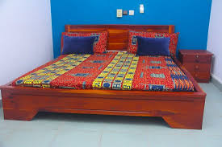
```

[La pauvreté au Bénin ](https://sarpn.org/documents/d0002244/La_pauvrete_au_Benin_AERC.pdf), 
Cet article nous renseigne sur les inégalités existantes au Bénin, en ce qui concerne l'âge, le sexe, le niveau d'instruction. Ainsi, il s'agira pour nous de comprendre si l'accès à l'équipement lit est le même pour tous au Bénin ?  Pour ce faire, nous chercherons à analyser les disparités existant au sein de la population du Bénin, en ce qui concerne l'équipement en lit au sein des différents ménages.
Pour ce faire, nous nous intéresserons dans un premier temps aux inégalités sociales. Puis dans un second temps, nous étudierons les inégalités spatiales présentes entre les différentes régions du Bénin.


#### Taux global d'équipement

```{r }
tab1<-wtd.table(x=don$equip,
               weights = don$WGT, 
               digits=1)
tab1
freq(tab1, digits=1)
```

On constate malheureusement que plus de la moitié de la population [^1] du Bénin possédaient cet équipement en 2013,c'est-à-dire 53,8%.Cependant, 46,2% des habitants du Bénin ne possèdent pas de lit, ce qui reste une proportion importante. 


### Inégalités sociales

```{r}
tabe<-wtd.table(x=don$sexe,
               y=don$equip,
               weights = don$WGT, 
               digits=0)
lprop(tabe)
```
On constate que les femmes détiennent moins de lit que les hommes, en effet 54,5%
des hommes détiennent un lit, contre 50,2% des femmes. 
De ce fait, nous pouvons constater une corrélation entre le taux d'équipement en lit et le sexe

#### L'effet du niveau d'éducation

```{r}
tab2<-wtd.table(x=don$etud5,
               y=don$equip,
               weights = don$WGT, 
               digits=0)
lprop(tab2)
```
On constate que 60% des individus qui n'ont pas fait d'études n'ont également pas 
l'équipement lit. De plus on constate que plus les individus ont fait des études longues,
plus ils possèdent l'équipement, en effet 87,4% des individus ayant fait des études supérieurs
possèdent un lit. Contre 40% des individus n'ayant pas fait d'étude. De ce fait, nous pouvons établir une corrélation entre le niveau d'étude et le nombre d'individu détenant l'équipement lit. 

### Taux d'équipement en fonction du niveau d'étude

```{r}
plot(tab2, 
     main="Taux d'équipement en fonction du niveau d'étude",
     sub = "Source : RP 2013, INS Bénin",
     col = c("blue","yellow")
     )
```
Le schéma suivant représentent le taux d'équipement en lit des ménages en fontion du niveau d'étude des individus.
On constate que plus un individus à fait des études longues, plus il détient le bien, en effet plus les études sont longues, plus les carrés jaunes montent vers le haut et les carrés bleus descendent vers le bas.

#### L'effet de l'âge du chef de ménage

```{r}
taby<-wtd.table(x=don$classeage,
               y=don$equip,
               weights = don$WGT, 
               digits=0)
lprop(taby)
```
Nous pouvons constater que les individus âgés de 35 à 65 ans sont ceux qui détiennent le plus l'équipement, en effet leur pourcentage de possession vari de 56,6% à 54%. Cela pourrait être expliquer par l'idée selon laquelle les chefs de ménages sont ceux qui selon les moeurs et les valeurs de la société du pays sont les plus légitimes à détenir le bien, cela en priorité des autres, dont les plus âgés et les plus jeunes. De plus, nous pouvons remarquer que ce sont les individus aux extrémités de l'âge qui détiennent le moins l'équipement. En effet, plus les individus sont jeunes moins ils détiennent de lit, 43% des 18-25 ans détiennent un lit. De même pour les individus âgés de 85 à 100 ans 44,6% d'entres eux détiennent un lit.

### Inégalités spatiales selon les départements

```{r}
tabr<-wtd.table(x=don$DEP_NAME,
               y=don$equip,
               weights = don$WGT, 
               digits=0)
lprop(tabr)
```
Le taux d'équipement varie en fonction du département d'habitation. En effet, nous pouvons remarquer que les habitants de la ville d'ALIBORI détiennet pour 57,4% l'équipement lit. Contre, seulement 32% dans la ville d'ATACORA. Les habitants du département Littoral détiennent le taux d'équipement lit pour 78,3% d'entres eux. Ce qui constitue le chiffre le plus élevé par rapport à tous les autres départements du Bénin. Cela peut-être expliqué par le fait que la capital économique du pays se trouve à Cotonou, qui se trouve elle au sein du département Littoral. De ce fait, le lieu de résidence est un facteur important pour indiquer le bien être d'un individu. 


#### L'opposition rural-urbain

```{r}
tabO<-wtd.table(x=don$URBA,
               y=don$equip,
               weights = don$WGT, 
               digits=0)
lprop(tabO)
```
On constate que les individus vivant dans le milieu urbain détiennent 66,2% de lit contre 46,8%
des habitants du milieu rural. De ce fait, la population résidant dans les milieux urbains détient dans la globalité plus de lit que les individus habitants dans les milieux ruraux

### Carte

```{r}
# Installe les packages de cartogaphie
library(sf, quietly=T)
library(mapsf,quietly = T)

# Charge le fonds de carte
map<-st_read("data/BEN-ADM1.shp", quiet=T)

# Ajoute les données
map$equip_nb<-tabr[,2]
map$equip_pct<-lprop(tabr,total=F)[,2]

# Trace la carte

## Pct d'équipement
mf_map(map, 
       type="choro",
       var="equip_pct",
       leg_pos = "right",
       leg_title = "taux d'équipement")
## Nb. de ménages équipés
mf_map(map, 
       type="prop",
       var="equip_nb",
       inches=0.1,
       leg_pos="topright",
       leg_title = "Ménages équipés")
## Cadre et titre
mf_layout(title = "Equipement en lit des ménages au Bénin",
          credits = "Source : RP 2013, INS Bénin",
          scale = T, 
          frame=T )

```
À partir de la carte, nous observons des inégalités d'équipement en lit selon les ménages En effet, on peut observer que les zones à l'Ouest du pays sont celles les moins aménagés en lit. À l'inverse des foyers au sud et à l'Est du pays. 

### Conclusion

Nos analyses nous amène à la conclusion que l'équipement en lit est disparitaire selon les individus
au Bénin. En effet, en fonction du sexe, de l'âge, du lieu d'habitation et du niveau d'éducation les individus ne possèdent pas un accès égalitaire à cet équipement.Effectivement les habitants résidents en ville détiennent un pourcentage de lit plus élevé que ceux résidents dans des zones rurales. De même pour le sexe, dans la globalité, les hommes détiennent plus de lit que les femmes, de même pour l'âge, les individus les plus jeunes et les individus les plus vieux sont ceux qui détiennent le moins de lit.De ce fait l'accès à l'équipement lit n'est pas le même pour tous et est donc facteur d'inégalités entre les populations au Bénin. 

### Bibliographie

[Voici le lien vers un article intéressant](https://instad.bj/images/docs/insae-statistiques/enquetes-recensements/Autres-Enquetes/AGVSA/Rapport_AGVSA_VF_2017.pdf)

[Voici le lien vers un article intéressant](https://blogs.worldbank.org/fr/africacan/regions-pauvres-regions-riches-la-geographie-explique-t-elle-tout)

## Fauteuil moderne

```{r, include=FALSE, echo=FALSE}


# Chargement
don<-read.table(file = "data/BEN-MEN-2013-SAMPLE.csv",
                header = T,
                sep =";",
                dec=",",
                stringsAsFactors = TRUE)

# Choix de l'équipement
don$equip<-don$faumo

# Recodage de la variable URBA
don$URBA<-as.factor(don$URBA)
levels(don$URBA) <- c("Rural","Urbain")

# Sélection des variables
don<-don[,c("ID","WGT","DEP_NAME","URBA","age","sexe","etud5","equip")]

```

### Introduction 
Dans le cadre de notre enquête, nous devons évaluer,en 2013, pour le Bénin et par départements, les différentes inégalités dans la possession, ou non, d'un fauteuil moderne. C'est un indicateur interessant à étudier puisqu'il peut être révélateur d'inégalités économiques, sociales ou spatiales entre différents ménages provenant de départements variés.Cela en fait un marqueur social.


#### Présentation de l'équipement
L'équipement que nous avons décidé d'étudier est le fauteuil moderne. En effet, comme nous venons tout juste de l'expliquer, outre les possibles indicateurs sur le carcatère socio-économique du ménage, ce dernier pourrait aussi nous permettre de rendre compte des conditions de vie au sein desquelles les ménages évoluent. Voici, ci dessous, un exemple de fauteuils modernes au Bénin.

```{r,fig.cap="Exemple de fauteuil moderne"}
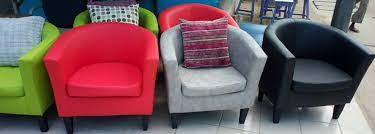
```


Ainsi, nous en venons donc à nous demander si la possession ou non d'un fauteuil moderne au Bénin constitue un indicateur d'inégalités économiques, sociales ou spatiales ? 
Pour ce faire, dans un premier temps, nous nous intéresserons aux inégalités sociales et verrons si le niveau d'étude du chef de ménage a une influence sur l'acquisitiin de ce bien. Puis, dans une seconde partie, principalement au travers de la dualité rural/urbain, nous tenterons de démontrer qu'il existe bien des inégalités spaciales.

#### Taux global d'équipement

```{r}
tab1<-wtd.table(x=don$equip,
               weights = don$WGT, 
               digits=1)
freq(tab1, digits=1)
```

Au travers de ce premier résultat, nous pouvons constater que plus de 80% des ménages ne possédaient pas de fauteuils modernes, tous départements confondus, au Bénin, en 2013. 


### Inégalités sociales

#### L'effet du niveau d'éducation

```{r}
tab2<-wtd.table(x=don$etud5,
               y=don$equip,
               weights = don$WGT, 
               digits=1)
tab2
lprop(tab2)
```

```{r}
plot(tab2, 
     main="Equipement des ménages en fauteuil moderne selon le niveau d'étude",
     sub = "Source : RP 2013, INS Bénin",
     col=c("pink", "blue"))
```
Tout d'abord, si l'on effectue une vue d'ensemble, on constate que de manière générale, plus le niveau d'études ou de diplôme du chef de ménage est élevé, plus le fait d'avoir chez soi un fauteuil moderne et augmente.
Ainsi, le taux d'équipement moderne a augmenté de manière considérable en corrélation avec le niveau d'étude du chef de ménage passant alors de 6,9% ne possédant aucun diplôme à 39% pour ceux du secondaire, jusque atteindre 63,4% pour les plus diplômés.
Cependant, comme nous le montre plus haut le graphique en bâtons, au travers de la largeur des bâtons : il y a un plus grand nombre de chefs de ménage sans diplôme et très peu sont ceux qui ont un niveau universitaire !


### Inégalités spatiales

#### L'opposition rural-urbain

#### Inégalités départementales 
A présent, nous allons voir les inégalités de possession de fauteuil moderne au Bénin en 2013, entre départements. 


```{r}
tab3<-wtd.table(x=don$DEP_NAME,
               y=don$equip,
               weights = don$WGT, 
               digits=0)
```


```{r}
tab3<-wtd.table(x=don$DEP_NAME,
                y=don$equip,
                weights = don$WGT,
                digits = 0)
tab3pct<- lprop(tab3)

kable(tab3pct,
      digits = 1,
col.nones = c("Non équipé", "Equipé", "Total"))
```
Au travers de ce premier tableau, nous pouvons constater que l'Atlantique, un département qui se situe tout au Sud du Bénin, est celui où les ménages sont le mieux équipés en fauteuil moderne avec 29,5% des ménages qui en possèdent un ! 
A contrario, c'est dans le département du Plateau que cet équipement se fait le plus rare : seuls 7,9% des ménages en sont équipés. 
Dans l'ensemble, on note que ce sont les départements où la pauvreté est la plus sévère que les fauteuils modernes se font rare chez les ménages : l'Atacora ou encore le Couffo.
Voici, ci dessous, une carte représentant les inégalités de possession d'un fauteuil moderne, en 2013, au Bénin entre départements : 

```{r}
### Carte

# Installe les packages de cartographie
library(sf, quietly=T)
library(mapsf,quietly = T)

# Charge le fonds de carte
map<-st_read("data/BEN-ADM1.shp", quiet=T)

# Ajoute les données
map$equip_nb<-tab3[,2]
map$equip_pct<-lprop(tab3,total=F)[,2]

# Trace la carte

## Pct d'équipement
mf_map(map, 
       type="choro",
       var="equip_pct",
       leg_pos = "right",
       leg_title = "taux d'équipement")
## Nb. de ménages équipés
mf_map(map, 
       type="prop",
       var="equip_nb",
       inches=0.1,
       leg_pos="topright",
       leg_title = "Ménages équipés")
## Cadre et titre


```

### Conclusion
En définitive, si dans un premier temps nous avons fait le lien entre le niveau d'éducation et de dplôme avec le fait de posséder un fauteuil moderne; nous nous sommes ensuite intéressés aux inégalités spatiales.
Finalement, ce sont les départements les plus pauvres qui sont victimes d'un nombre de ménages très faible ayant des fauteuils modernes : on pourrait ici évoquer également une reproduction sociale en fonction des revenus, du lieu d'habitation et du niveau d'éducation. 
Ainsi, la possession de ce bien est donc un indicateur de réalités économiques et sociales, notamment en terme d'inégalités, au Bénin, en 2013.


## Cuisinière

```{r, include=FALSE, echo=FALSE}


# Chargement des données 
don<-read.table(file = "data/BEN-MEN-2013-SAMPLE.csv",
                header = T,
                sep =";",
                dec=",",
                stringsAsFactors = TRUE,
                fileEncoding="UTF-8-BOM")              #Solution pb d'encodage


# Choix de l'équipement cuisinière
don$equip<-don$cuisi

# Recodage de la variable URBA
don$URBA<-as.factor(don$URBA)
levels(don$URBA) <- c("Rural","Urbain")

# Recodage de la variable tailmen en class
limit_class <- c(0,15,75)
don$tailmen <- cut(don$tailmen, breaks = limit_class)


# Sélection des variables
don<-don[,c("ID","WGT","DEP_NAME","URBA","DEP_CHEF","statoc","etud5","equip")]

don


```

```{r,fig.cap="Rayon proposant des cuisinière au Bénin."}
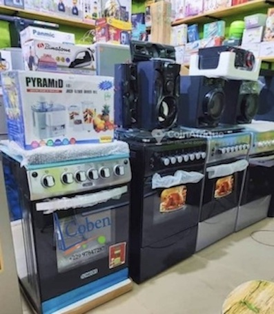
```


### Introduction
Une cuisinière est un appareil ménager composé d'une table de cuisson, ainsi que d'un four intégré. Nous verrons que les cuisinières sont des indices tangibles d'inégalités au sein de la population béninoise. 
Afin d'étudier ces inégalités, nous avons à notre disposition un jeu de données issu du RP 2013. Celles-ci ont été extraites par tirage au sort de 100 ménages des 546 arrondissements du Bénin. 
Dans une première partie, nous étudierons le niveau général d'équipement en cuisinière du Bénin. Dans une seconde partie, nous traiterons des inégalités départementales. Dans une troisième partie, nous aborderons les inégalités sociales au prisme du niveau d'étude de ses composantes. Enfin, nous conclurons. 

### Taux global d'équipement

```{r}
#library(kableExtra)
tab1 <- wtd.table(x<-don$equip,
                 weights = don$WGT,
                 digits = 1 )

tab1 <- freq(tab1)
tab1 <- tab1[,1:2]
kable(tab1, 
  #    format = "markdown", 
      col.names = c("Nominal", "Pourcentage"), 
      caption = c("Présence de cuisinière au Bénin."))

```

```{r, echo=FALSE}
#Package graphiques
library(ggplot2)

#Donnees pour tracer un diagramme circulaire 
data_diag_cir = data.frame(categorie = c("Absence de Cuisinière","Cuisinière"),
  valeur = tab1[,1])

#Tracer le diagramme circulaire ( étapes à commenter)
diag_cir <- ggplot(data_diag_cir, 
                   aes(x = "", y = valeur, fill = categorie)) +   
                   geom_bar(stat = "identity") +
                   coord_polar(theta = "y") +
                   scale_fill_viridis(discrete = TRUE, option = "D") +       #couleurs 
                   labs(title = "Proportion de ménages possédant une cuisinière",                    
                   x = "" , y = "", fill = "Catégories") +                   #Ajouter titres 
                   theme_void()                                              #Enlever les légendes par défaut


diag_cir


```

On observe que seulement 5,3 % des ménages[^1] du Bénin sont équipés en cuisinière. Mettons en lumière, les inégalités qui expliquent la faible présence de l'équipement dans ce pays.


### Inégalités spatiales 

#### Inégalités départementales  

```{r, echo= FALSE}
tab3<-wtd.table(x=don$DEP_NAME,
               y=don$equip,
               weights = don$WGT, 
               digits=0)

tab3 <- lprop(tab3)
tab3 <- tab3[1:12,]

```

```{r, echo=FALSE}

# Installe les packages de cartogaphie

suppressMessages({                           #Suppression messages parasites
  library(sf, quietly = TRUE)
  library(mapsf, quietly = TRUE)
})

# Charge le fonds de carte
map<-st_read("data/BEN-ADM1.shp", quiet=T)

# Ajoute les données
map$equip_nb<-tab3[,2]
map$equip_pct<-lprop(tab3,total=F)[,2]

# Trace la carte

## Pct d'équipement
mf_map(map, 
       type="choro",
       var="equip_pct",
       leg_pos = "right",
       leg_title = "taux d'équipement")

## Nb. de ménages équipés
mf_map(map, 
       type="prop",
       var="equip_nb",
       inches=0.1,
       col = "#FDE725FF",
       leg_pos="topright",
       leg_title = "Ménages équipés")

## Cadre et titre
mf_layout(title = "Equipement du Bénin en cuisnières",
          credits = "Source : RP 2013, INS Bénin",
          scale = T, 
          frame=T )

```

Avec cette carte, nous constatons que la répartition des cuisinières est inégalitaire entre les départements. Ainsi, nous voyons que ceux du littoral sont plus équipés que les autres. Cela coïncide avec la position de la capitale Cotonou et ses infrastructures internationales et commerciales,comme le port ou l'aéroport de cette dernière. De plus, il a déjà été montré que l'accessibilité énergétique de cuisson [^2] n'est pas uniforme au Bénin.

### Inégalités sociales

#### Inégalités selon le niveau d'étude

```{r}
tab7<-wtd.table(x=don$etud5,
               y=don$equip,
               weights = don$WGT, 
               digits=0)

tab7<- lprop(tab7)
tab7 <- tab7[1:4,1:2]
kable(tab7, 
      format = "markdown",
      digits = 1,
      caption = c("Possession de cuisinière selon niveau de diplôme."))

plot(tab7, main= "Possession de cuisinière selon niveau de diplôme", col = viridis(2))

```

Ce diagramme nous montre une forte corrélation entre le niveau d'étude et la possession d'une cuisinière. En effet, il y a près de 37,1 % des ménages qui possèdent une cuisnière et un diplôme de l'enseignement supérieur. En comparaison, ils ne sont que 1 % à ne pas avoir de diplôme et à en être équipés. D'autres part, il a été montré à de nombreuse reprises que le niveau d'étude[^3] est un facteur important de la richesse d'un ménage. 

### Conclusion

Nous avons montré que la possession de cuisinière au Bénin est inégalitaire. 
Des disparités apparaissent entre départements. D'un point de vue géographique, la possession d'une cusinière requiert l'accès physique à cette marchandise importée, mais aussi, l'accès aux infrastructures énergétiques nécessaires au fonctionnement de celle-ci.    
À la disponibilité géographique des équipements et des infrastructures, s'ajoute la possibilité d'accéder à un service ou à un bien, financièrement.
La tendance entre le niveau de diplôme et le salaire peut éclairer sur le lien entre le niveau de diplôme et la possession d'une cuisinière. Cet équipement serait majoritairement possédé par les ménages urbains et favorisés financièrement. 
Des politiques d'accès à l'éducation et de justice énergétique permettraient-elles de pallier ces inégalités ?


## Bicyclette

```{r, include=FALSE, echo=FALSE}

# Chargement
don<-read.table(file = "data/BEN-MEN-2013-SAMPLE.csv",
                header = T,
                sep =";", #séparateur (ici, des points-virgule)
                dec=",",
                stringsAsFactors = TRUE) # le texte est transforme en facteurs

# Choix de l'équipement
don$equip<-don$bicyc

# Recodage de la variable URBAN
don$URBA<-as.factor(don$URBA)
levels(don$URBA) <- c("Rural","Urbain")

# Sélection des variables
don<-don[,c("ID","WGT","DEP_NAME","age","URBA","sexe","etud5","equip","bicyc")]

```

#### Présentation de l’équipement

```{r,fig.cap="Exemple de Bicyclette"}
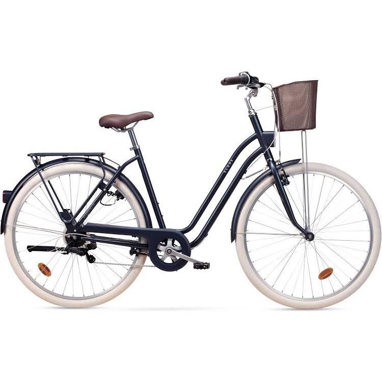
```

Dans ce projet, des analyses statistiques seront présentées sur un échantillon aux ménages du Bénin lors du RP 2013.

Selon le site [Quilicot](https://www.bicyclesquilicot.com/fr/blogue/article/10-bienfaits-du-velo-sur-la-sante), mentionne quelques bonne raisons la bicyclette bénéfice la santé: un cerveau plus performant, diminue du risque de diabète, bon pour la santé mentale, un meilleur système cardiovasculaire, améliore l´équilibre, diminue du risque de développer un cancer, plus d´énergie, et un bon système immunitaire [@bicycleQuillicot2023].

#### Taux global d'équipement

```{r} 

tab1<-wtd.table(x=don$equip,
              weights = don$WGT, 
               digits= 0 )

freq(tab1, digits=1)

```

On constate malheureusement que 27% des ménages[^1] du Bénin possédaient cet équipement en 2013, c´est un très petite chiffre de la population, en tant compte du fait que le bicyclette est très bénéfique pour la santé.


### Inégalités sociales

#### L'effet du niveau d'éducation

```{r}
tab2<-wtd.table(x=don$etud5,
               y=don$equip,
               weights = don$WGT,
               digits= )

tabpct <- lprop(tab2)

kable(tabpct, 
      col.names = c("Non","Oui","Total"),
      digits=1,
      caption =c("% de Bicyclette par niveau d´éducation"))

```

```{r}
plot(tab2, 
     main="Equipement des ménages en bicyclette
          par niveau d'éducation",
     sub = "Source : RP 2013, INS Bénin",
     col= c("pink" ,"black")
     )
```

On peut observer que 16.6% des ménages à niveau superior[^1] du Bénin possédaient cet équipement en 2013, on peut voir que le percentage diminute avec le niveau d´éducation. On pourrait dire que c'est lié au pouvoir d'achat et à la possibilité d'utiliser d'autres moyens de transport, qui ne sont pas gratuits.


### Inégalités spatiales

#### L'opposition rural-urbain

```{r}
tab3<-wtd.table(x=don$URBA,
               y=don$equip,
               weights = don$WGT,
               digits=0)

tabpct <- lprop(tab3)

kable(tabpct, 
      col.names = c("Non","Oui","Total"),
      digits=1,
      caption =c("% de Bicyclette par l´opposition rural-urbain"))

```

```{r}
plot(tab3, 
     main="Equipement des ménages en bicyclette 
         par rural - urbain",
     sub = "Source : RP 2013, INS Bénin",
     col= c("pink" ,"white")
     )
```

On peut observer que 19% des ménages dans les zones urbaine contre 32% dans les zones rurales [^1] du Bénin possédaient cet équipement en 2013.    On pourrait conclure que le distances en une ville sont plus longues et le traffic faire que la bicyclette n´est pas le meilleur moyen de transport.


#### Inégalités départementales

```{r}
tab4<-wtd.table(x=don$DEP_NAME,
               y=don$equip,
               weights = don$WGT, 
               digits=0)

tabpct <- lprop(tab4)

kable(tabpct, 
      col.names = c("Non","Oui","Total"),
      digits=1,
      caption =c("% de Bicyclette par département"))
```

On peut observer que dans: Littoral, Oueme, Atlantique et Mono, moins de 20% des ménages [^1] du Bénin possédaient cet équipement en 2013.Ces ville sont les plus petites et ils ont tous une plage donc marcher pourrait être plus pratique en raison des distances et de la vie plus détendue de la côte.


### Carte

```{r}
# Installe les packages de cartogaphie
library(sf, quietly=T)
library(mapsf,quietly = T)

# Charge le fonds de carte
map<-st_read("data/BEN-ADM1.shp", quiet=T)

# Ajoute les données
map$equip_nb<-tab4[,2]
map$equip_pct<-lprop(tab4,total=F)[,2]

# Trace la carte

## Pct d'équipement
mf_map(map, 
       type="choro",
       var="equip_pct",
       leg_pos = "right",
       leg_title = "taux d'équipement")
## Nb. de ménages équipés
mf_map(map, 
       type="prop",
       var="equip_nb",
       inches=0.1,
       leg_pos="topright",
       leg_title = "Ménages équipés")
## Cadre et titre
mf_layout(title = "Equipement du Bénin en foyers aménagés",
          credits = "Source : RP 2013, INS Bénin",
          scale = T, 
          frame=T )

```

### Conclusion

On peut conclure que 27% des données de l'échantillon possèdent une bicyclette, le pourcentage de vélo diminue avec le niveau d'éducation 33% sans études contre 16% avec un diplôme supérieur, il est plus fréquent dans les zones rurales 32% contre 19% dans les zones urbaines, la taille de la région joue également un rôle important.

### Bibliographie

https://www.bicyclesquilicot.com/fr/blogue/article/10-bienfaits-du-velo-sur-la-sante


## Frigo


### *Introduction*
Le dossier nous aide à **comprendre les inégalités au Bénin** grâce à différents biens d'équipements. Dans cette partie nous allons traiter du réfrigérateur[^38].  

[^38]: Dans cette étude nous désignerons dans le texte la variable de notre base de données frigo/equip par réfrigérateurs.  

> Les réfrigérateurs nous donnent-ils des éléments de compréhension sur la répartition des biens d'équipement au Bénin ?  

En premier lieu nous verrons la situation générale de l'équipement en réfrigérateur, en second lieu nous verrons l'expression d'inégalités spatiales et enfin les inégalités sociales face aux réfrigérateurs. 
 
```{r,fig.cap="Réfrigérateurs en vente à Cotonou", fig.align='center', fig.dim= c(6,3)}
# Insertion d'une image 
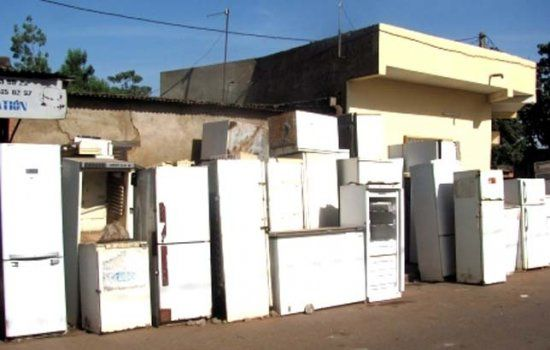
```

### Premières observations
```{r}
# Importation de la base de données depuis excel
don<-read.table(file = "data/BEN-MEN-2013-SAMPLE.csv",
                header = T,
                sep =";",
                dec=",",
                stringsAsFactors = TRUE)

# Changement du nom de la variable pour faciliter le traitement
don$equip<-don$frigo

# La variable URBA a besoin de devenir un facteur pour pouvoir l'utiliser efficacement. Elle nous renseigne de l'endroit dans lequel se situe le ménage, si il est plutôt urbain ou rural.
don$URBA<-as.factor(don$URBA)
levels(don$URBA) <- c("Rural","Urbain")

# On sélectionne les colonnes du tableaux qui nous intéresse permettant de rendre le tableau plus lisible
don<-don[,c("ID","WGT","DEP_NAME","URBA","age","sexe","etud5",
            "equip", "elgen")]
```

```{r, fig.dim= c(6,3)}
# Création d'un tableau qui résume le pourcentage d'équipement en réfrigérateurs au Bénin. 
tab1<-wtd.table(x=don$equip,
               weights = don$WGT, 
               digits=1)
#La fonction kable permet de mettre en forme des tableau, ici un tableau de fréquence
kable(freq(tab1, digits=1), caption = "Réfrigérateur au Bénin",  col.names = c("Total", "Pourcentage", "val%"))

#Pour obtenir des résultats applicable à l'ensemble de la population il faut les pondérer
```

Il n'y a seulement 78810 personnes qui ont un réfrigérateur au Bénin ce qui représente seulement 6% de la population.  

```{r, fig.dim= c(6,3)}
#Permettre l'affichage de 2 graphiques sur la même ligne
par(mfrow = c(1,2))

# Création de graphiques à propos des individus ayant l'électricité ou des réfrigérateurs 
plot(don$elgen, 
main  = "Electricité", 
col = "#08C5D1")

plot(don$equip, 
     main  = "Réfrigérateur",
     col = "#00353F")
```

Les graphiques ne donnent que peu d'informations mais cela nous permet de constater que toutes les personnes qui ont de l'électricité n'ont pas forcément de réfrigérateur. On peut donc en déduire que tout les individus n'y ont pas accès et cela est certainement signe d'inégalités.  

### Observations d'inégalités spatiales

#### En fonction des départements
```{r,fig.dim= c(6,3),message=FALSE, warning = FALSE}
# Création d'un tableau qui montre la répartition en réfrigérateurs en fonction des départements d'habitation
tab2 <- wtd.table(don$DEP_NAME, don$equip, weights = don$WGT)

#Utilisation de la fonction prop_table pour transformer le tableau en pourcentage
prop.table(tab2,1)

#Transformer l'observation des tableaux en carte
library(sf, quietly=T)

library(mapsf, quietly = T)

# Importation du fond de carte du Bénin
map<-st_read("data/BEN-ADM1.shp", quiet=T)

# On ajoute les données dans la variable map
map$equip_nb<-tab2[,2]
map$equip_pct<-lprop(tab2,total=F)[,2]

## Affichage des pourcentages d'équipement en réfrigérateurs
  mf_map(map, 
         type="choro",
         var = "equip_pct",
         leg_pos = "left",
         leg_title = "Taux d'équipement", pal = c("#CBFACF", "#83EE99", "#59CD97", "#38A7A6", "#225B7C"))
  ## Affichage du nombre de ménages équipés
  mf_map(map, 
         type="prop",
         var ="equip_nb",
         inches=0.09,
         leg_pos="topright",
         leg_title = "Ménages équipés",
         col = "#AC3940")
  
  ## Ajout d'un cadre et d'un titre
  mf_layout(title = "Equipement du Bénin en réfrigérateurs",
            credits = "Source : RP 2013, INS Bénin",
            scale = T, 
            frame=T )
```

La carte nous permet de constater que la majorité des réfrigérateurs au Bénin se trouvent logiquement dans les départements les plus équipés mais qu'ils se trouvent surtout au Sud, le long du littoral et en moindre importance au Nord-est du Bénin. Ce sont aussi les zones avec le plus d'agglomération d'après [OpenEdition](https://journals.openedition.org/eps/docannexe/image/8083/img-1-small480.png). 

#### En fonction de si l'espace est urbain ou rural
```{r, fig.dim= c(6,3)}
#Création d'un tableau permettant de confirmer le lien observé avant
tab4 <- wtd.table(don$URBA, don$equip, weights = don$WGT)

#Mise en forme du tableau en graphique 
plot(tab4, main = "Réfrigérateur en espace rural/urbain", col = c("#7B9DD2", "#70C7C6"))
```

Cela nous confirme la première observation faites grâce au département. En effet, j'évoque le fait que les réfrigérateurs sont concentrés en milieu urbain et c'est exactement ce que le graphique montre.  

### Observations d'inégalités sociales

#### Le niveau de diplôme aggrave les inégalités
```{r, fig.dim= c(6,3)}
#Création d'un tableau permettant de voir la relation entre les personnes équipées en réfrigérateurs et leurs niveaux de diplôme
tab3 <- wtd.table(don$etud, don$equip, weights = don$WGT)

kable(tab3, caption = "Réfrigérateurs selon le diplôme",)

plot(tab3, main = "Réfrigérateurs selon le diplôme", col = c("#EBF2F4", "#427AA1"))
```

Les inégalités peuvent aussi s'observer grâce aux différences de diplôme. On peut faire une corrélation positive entre le niveau de revenu et le niveau de diplôme. Plus le niveau de diplôme d'un individu est élevé plus il aura tendance à bien gagner sa vie. On voit avec le graphique que plus le niveau de diplôme est élevé plus les individus possèdent des réfrigérateurs, par conséquent on peut penser que seuls les ménages les plus aisés peuvent avoir un réfrigérateur.  

___

### *Conclusion*

En somme, les réfrigérateurs permettent de remarquer des inégalités au Bénin. Premièrement il y a une inégale répartition entre les individus, ce qui peut-être expliqué par les différences de diplôme par un effet de richesse. Ensuite et ce qui semble expliquer le plus les inégalités entre les espaces est le fait d'avoir de l'electricité. En effet il y a surtout des réfrigérateurs en zone urbaine, zones dans lesquelles les individus sont les plus susceptibles d'avoir le courant. Cependant cela n'invalide pas les conclusions que l'on peut faire sur les inégalités puisque tout les individus ayant l'electricité n'ont pas forcément des réfrigérateurs. Il y a donc bien des différences sur l'équipement des ménages au Bénin à l'échelle des réfrigérateurs.  

## Matelas

<style type="text/css">
  body{
  font-size: 12pt;
  font-family: lato;
}
</style>


#### Introduction

<div class="row">
<div class="col-md-6">

<div align="justify">L'objectif de ce chapitre est de produire un rapport sur l'équipement des ménages du Bénin en matelas, objet utilitaire de base et constitutif du foyer standardisé. Le matelas est un assemblage de tissu rembourré sur lequel on dort : il est présent dans la chambre, il ne nécessite pas de lit pour être utilisé et a pour objectif l'octroit de confort durant la nuit. L'équipement en matelas dans un pays comme le Bénin représente même dans certains cas un enjeu de santé publique, comme le montrent les missions humanitaires de **l'Association MJ pour l'enfance** qui consistent en des distributions de matelas aux populations au Bénin[^42].

[^42]: [Association MJ pour l'enfance](https://www.asso-mj-enfance.org/missions-humanitaires-sante.php)

Nous nous baserons pour notre étude sur un échantillon de variables relatives aux ménages du Bénin tirées du recensement de la population de 2013[^24]. 

[^24]: Il s’agit plus précisément d’une extraction par tirage au sort de 100 ménages dans chacun des 546 arrondissements du Bénin. Le tirage au sort a été effectué en se limitant aux ménages composés d’au moins deux personnes, dont le chef de ménage est marié ou en union libre et dont les variables choisies ne comportent pas de valeurs manquantes ou non renseignées. La base de sondage se compose donc d’1.305 millions de ménages sur les 2 millions que compte le Bénin au moment du recensement de la population. L’échantillon comporte exactement 54600 lignes (100 pour chacun des 546 arrondissements).

Dans un premier temps, nous présenterons des résultats généraux pour ensuite mettre en lumière des inégalités sociales quant à l'équipement en matelas au Bénin en 2013. La troisième partie de ce rapport aura pour problématique les inégalités spatiales qui sont liées aux inégalités sociales par rapport à l'équipement en matelas, et nous expliquerons pourquoi.</div>

</div>
<div class="col-md-6">

<div align="center">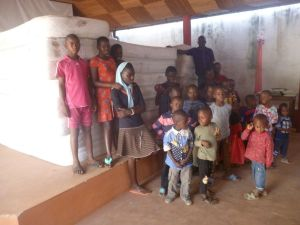</div>
<div align="center">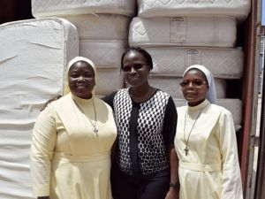</div>

</div>
</div>

```{r mise_en_place_des_données}

don<-read.table(file = "data/BEN-MEN-2013-SAMPLE.csv",
                header = T,
                sep =";",
                dec=",",
                stringsAsFactors = TRUE)

don$equip <- don$matel
```

</br>

### Résultats généraux

#### Taux global d'équipement en matelas du pays

```{r}
tab1<-wtd.table(x = don$equip,
              weights = don$WGT, 
              digits = 1)
tab2 <- freq(tab1, digits = 0)
tab2 <- tab2[,c("n","%")]
colnames(tab2) <- c("En chiffres", "En pourcentages")
rownames(tab2) <- c("Non équipés", "Équipés")
kable(tab2, digits = 1)
```

<div align="justify">D'après les résultats obtenus, on constate qu'une majorité de ménages du Bénin ne se trouvent pas équipés en matelas (62%, soit presque deux tiers), équipement qui représente pourtant un objet utilitaire de base au sein du foyer. Même sans lit, un matelas peut être utilisé et participe au confort de la nuit. Ces résultats nous permettent de formuler deux hypothèses principales : soit le matelas est un équipement trop coûteux pour la majorité de la population pour un pays considéré comme pauvre sur le plan économique comme le Bénin (166^e^ pays sur 191 au classement de l'IDH de la [Banque mondiale en 2019](https://www.banquemondiale.org/fr/country/benin/overview)), soit le matelas est un objet marqué culturellement qui diffère avec les coutumes des Béninois, qui usent peut-être d'un substitut au matelas.
Les données à notre disposition ne nous permettent cependant pas de vérifier la seconde hypothèse, et en considérant ces mêmes données, qui ont été récoltées en suivant une certaine logique, et du fait même de la présence de données sur l'équipement des ménages du pays en matelas, on ne peut qu'accorder plus de crédit à la première hypothèse.</div>

</br>

### Inégalités sociales

<div align="justify">Les données à notre disposition nous permettent de mettre en lumière certaines inégalités sociales qui structurent l'équipement des ménages du Bénin en matelas en 2013, et il convient donc de s'y intéresser.</div>

#### L'effet du statut d'occupation : propriétaires ou locataires de logements

<div class="row">
<div class="col-md-6">

```{r}
tab3<-wtd.table(x=don$statoc,
               y=don$equip,
               weights = don$WGT, 
               digits=1)
tab3 <- lprop(tab3, digits = 0)
colnames(tab3) <- c("Non équipés", "Équipés", "Ensemble (en %)")
rownames(tab3) <- c("Autre", "Locataire", "Propriété familiale", "Propriété individuelle", "Ensemble (en %)")
kable(tab3, digits = 1)
```

</div>
<div class="col-md-6">

```{r}
tab4<-wtd.table(x=don$statoc,
               y=don$equip,
               weights = don$WGT, 
               digits=1)
rownames(tab4) = c("Autre", "Locataire", "Prop. familiale", "Prop. individuelle")
colnames(tab4) = c("Non équipés", "Équipés")
plot(tab4, 
     col = c("yellow", "cyan4"),
     main="L'équipement en matelas en fonction du statut d'occupation",
     sub = "Source : RP 2013, INS Bénin"
     )
```

</div>
</div>

<div align="justify">On observe que les locataires de logements au Bénin sont majoritairement équipés de matelas (à hauteur de environ 72%), ce qui diffère des propriétaires, qu'il s'agisse de propriétés individuelles ou familiales. Ceci pourrait potentiellement s'expliquer en particulier parce que les logements loués doivent répondre à certaines normes, notamment de présence d'équipements de base, ou tout simplement que pour rendre attractives les locations, les bailleurs aménagent les logements en matelas. Cependant, faute d'informations sur la question, cette hypothèse est invérifiable.</div>

#### L'effet du niveau d'étude

<div align="justify">Nous ne disposons pas de données quant aux revenus des Béninois, qui auraient pu nous être utiles en vue de vérifier notre hypothèse de base qui met en relation le revenu avec le fait d'être équipé ou non en matelas. Néanmoins, le niveau d'étude des Béninois est renseigné. En considérant que le niveau d'étude est corrélé avec le degré de revenu[^39], nous pouvons suivre cette logique :
- plus le niveau d'étude est élevé, plus le ménage étudié est riche;
- plus le ménage étudié est riche, plus il est susceptible d'être équipé en matelas.</div>

[^39]: [Sur la corrélation entre niveau d'étude et niveau de revenu](https://www.undp.org/sites/g/files/zskgke326/files/migration/africa/Overview-Income-inequality-Trends-SSA_FR-web.pdf)

```{r}
tab5<-wtd.table(x=don$etud5,
               y=don$equip,
               weights = don$WGT, 
               digits=0)
rownames(tab5) = c("Aucun", "Primaire", "Secondaire", "Supérieur")
colnames(tab5) = c("Non équipés", "Équipés")
plot(tab5,
    col = c("yellow", "cyan4"),
     main = "L'équipement en matelas en fonction du niveau d'étude",
     sub = "Source : RP 2013, INS Bénin")
```

<div align="justify">Il semble que le niveau d'étude (et indirectement, le degré de revenu) ait un impact certain sur le taux d'équipement en matelas des Béninois. Notre première hypothèse retenue se trouve donc vérifiée en suivant cette grille analytique.</div> 

</br>

```{r}
tab6 <- lprop(table(don$statoc, don$etud5), digits = 1)
tab6 <- tab6[2:4,1:4]
colnames(tab6) = c("Aucun", "Primaire", "Secondaire", "Supérieur")
rownames(tab6) = c("Locataire", "Propriété familiale", "Propriété individuelle")
kable(tab6, digits = 1)
```
<div align="justify">Pour finir sur cet aspect, lorsque l'on met en relation le niveau d'étude et le statut d'occupation, on se rend bien compte que plus les ménages disposent d'un niveau d'étude élevé, plus ils sont susceptibles d'être locataires. D'après ce que l'on a déjà relevé, les ménages avec un plus haut niveau d'étude sont également les mieux dotés économiquement, on peut donc légitimement penser que l'accès à la location est inégalitaire au Bénin : seuls les ménages disposant d'un certain niveau d'étude et donc de revenu peuvent être locataires, donc disposer de foyers mieux équipés en matelas.</div>

#### L'effet de la taille du ménage

```{r, include = FALSE}
tab7<-wtd.table(x=don$tailmen,
               y=don$equip,
               weights = don$WGT, 
               digits=0)
lprop(tab7)
```
<div align="justify">La taille du ménage est une variable qui a peu d'impact sur l'équipement en matelas au Bénin. Pour un pays dont le nombre d'enfant par femme moyen est de 5,34 en 2013 d'après la Banque mondiale, rien ne nous indique qu'une augmentation de la taille de la famille ou du ménage ait un impact sur l'équipement en matelas. Néanmoins, on peut observer des ménages extrêmement nombreux (de 38, 41, 43, 62, 64 ou 72 personnes) entièrement équipés en matelas. On peut alors légitimement penser à des institutions d'hébergement, comme des orphelinats ou des foyers, qui seraient entièrement équipés.</div>

</br>

### Inégalités spatiales

#### Le taux d'équipement pour chaque département du Bénin

<div class="row">
<div class="col-md-6">

```{r}


tab8<-wtd.table(x=don$DEP_NAME,
               y=don$equip,
               weights = don$WGT, 
               digits=0)
tab8 <- lprop(tab8,total=F)
colnames(tab8) = c("Non équipés", "Équipés (en %)")
kable(tab8, digits = 1)
tab9<-wtd.table(x=don$DEP_NAME,
               y=don$equip,
               weights = don$WGT, 
               digits=0)
```

</div>
<div class="col-md-6">

```{r}
map<-st_read("data/BEN-ADM1.shp", quiet=T)

map$equip_nb<-tab9[,2]
map$equip_pct<-lprop(tab9,total=F)[,2]

mf_map(map, 
       type="choro",
       var="equip_pct",
       leg_pos = "right",
       leg_title = "Taux d'équipement pour chaque département",
       leg_title_cex = 0.65)

mf_map(map, 
       type="prop",
       var="equip_nb",
       inches=0.1,
       col="yellow",
       leg_pos="topright",
       leg_title = "Nombre de ménages équipés")


mf_layout(title = "Équipement du Bénin en matelas",
          credits = "Source : RP 2013, INS Bénin",
          scale = T, 
          frame=T )
```

</div>
</div>

<div align="justify">On observe nettement grâce à cette carte et aux taux d'équipement pour chaque département que les départements du sud du Bénin, c'est-à-dire les départements littoraux qui sont les plus dynamiques et économiquement avantagés[^4], disposent des plus forts taux d'équipement en matelas : ceci renforce notre hypothèse selon laquelle la possession de cet objet utilitaire de base est lié au niveau de revenu du ménage béninois.

En d'autres termes, on comprend les inégalités spatiales dans le cas de l'équipement en matelas en lien avec les inégalités sociales qui s'expriment géographiquement au Bénin : la région littorale, plus urbanisée et économiquement avantagée, est mieux dotée en matelas que le Nord et le centre du pays, zones majoritairement rurales, agraires et moins dynamiques[^43].</div>

[^43]: [Rapport des nations unies sur la question](https://www.undp.org/sites/g/files/zskgke326/files/migration/bj/e0e3c1a01557e2e2e0b9fa3b7e7d3669207966e0297c0068fd8f3ab2f15c74ac.pdf)

</br>

### Conclusion

<div align="justify">Pour conclure, le fait de disposer d'un objet utilitaire de base comme le matelas reste un enjeu pour les ménages du Bénin en 2013. Notre étude tend à expliquer ce faible équipement des ménages en matelas du fait d'un manque de ressources économiques pour se le procurer. L'absence de matelas au sein du foyer, lorsque ce phénomène est généralisé, peut conduire à des problématiques en matière de santé publique, c'est notamment ce que l'Association MJ pour l'enfance souligne grâce à son intervention au Bénin[^1].

### Bibliographie et sitographie

TANTCHOU Josiane, « En Afrique, la matérialité du soin au cœur des tensions soignants-soignés ? », Sciences sociales et santé, 2017/4 (Vol. 35), p. 69-95. DOI : 10.1684/sss.2017.0405. URL : https://www.cairn.info/revue-sciences-sociales-et-sante-2017-4-page-69.htm

https://www.undp.org/fr/benin/publications/rapport-annuel-2022-du-pnud-benin

https://www.banquemondiale.org/fr/country/benin/overview

https://www.asso-mj-enfance.org/operation-1-500-matelas-en-afrique.php

### Notes

---

## Magnetoscope

### Introduction :

Ce rapport d'étude nous permettra d'examiner l'équipement des magnétoscopes au Bénin en 2013 qui fut une grande source culturelle et technologique malgré son statue d'ancètre. Ce rapport nous aidera dans l'identification de possibles facteur, plus précisemment des inégalités, sociaux et/ou spatiaux et ceci en se servant des données acquises du recensement du Bénin en 2013.
C'est à partir du recensement de la population du Bénin faite en 2013 que nous avions pu extraire des données sur un échantillon de 54600 ménages[^5] dont 100 ménages par arrondissement[^51].


[^51]: Nous utiliserons le chiffre de l'arrondissement en question suivi d'un code à trois chiffres afin d'avoir un suivi.

```{r , include=FALSE, echo=FALSE}


# Chargement :
don<-read.table(file = "data/BEN-MEN-2013-SAMPLE.csv",
                header = T,
                sep =";",
                dec=",",
                stringsAsFactors = TRUE)

# Choix de l'équipement :
don$equip<-don$magne

# Recodage de la variable URBA :
don$URBA<-as.factor(don$URBA)
levels(don$URBA) <- c("Rural","Urbain")

# Sélection des variables :
don<-don[,c("ID","WGT","DEP_NAME","URBA","age","sexe","etud5","equip")]

```

### Equipement en foyer aménagé :

#### Présentation du Magnétoscope :
```{r,fig.cap="Le Magnétoscope au Bénin"}
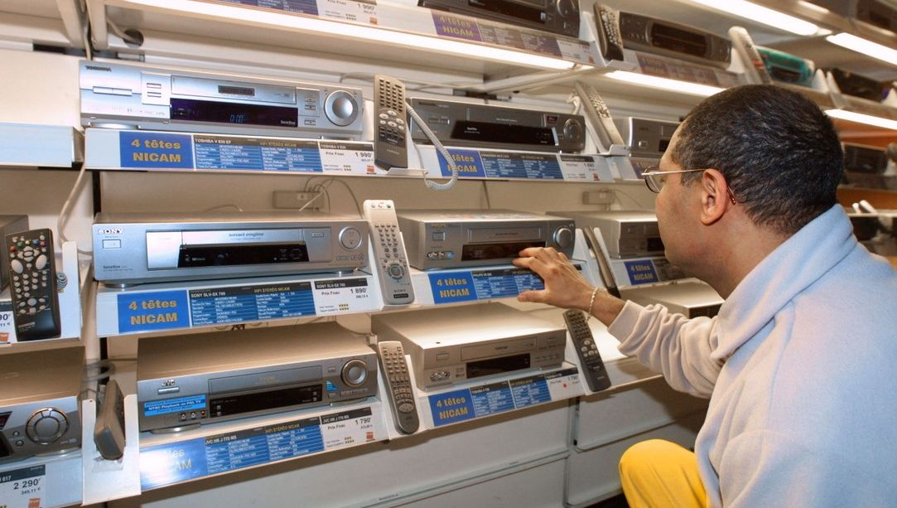
```

D'aprés le rapport de [l'Institue National de la Statistique et de l'Analyse Economique](https://documents1.worldbank.org/curated/zh/200021468226191071/pdf/936820FRENCH0W0a0Pauvret00Mars02014.pdf)[^33], les biens possédés tels que les magnétoscopes seraient de bons moyens pour tirer des informations afin d'évaluer le taux de pauvreté en Bénin. Dans ce cas là, nous prenons le magnétoscope comme indicateur qui nous permettra de saisir les inégalités sociales et/ou spatiales du Bénin.

[^33]: Institut National de la Statistique et de l'Analyse Economique (INSAE), Évaluation de la Pauvreté au Bénin, Mars 2014

#### Taux global d'équipement :

```{r}
tab1<-wtd.table(x=don$equip,
               weights = don$WGT, 
               digits=1)
freq(tab1, digits=1)
```

On constate qu'environ 65736 ménages du Bénin possédaient un magnétoscope en 2013 parmi 1305188 autrement dit seulement 5% des ménages pouvaient se permettre d'avoir un magnétoscope.

### Inégalités sociales

#### L'effet du niveau d'éducation

```{r}
tab2<-wtd.table(x=don$etud5,
               y=don$equip,
               weights = don$WGT, 
               digits=0)
lprop(tab2)
```
 
```{r}
plot(tab2, 
     main="L'effet du niveau d'étude sur
     l'équipement d'un magnétoscope au Bénin en 2013",
     sub = "Source : RP 2013, INS Bénin",
     col=c("green","violet")
     )
```

On remarque que plus le niveau d'étude d'un ménage est superieur, plus important sera sa probabilité d'avoir un magnétoscope ce qui fait éco au niveau de pauvreté mis en valeur par l'INSAE dans son rapport comme quoi les biens possédés tels que le magnétoscope seraient des indices du niveau d'éducation des ménages et donc de leur niveau de vie : Une personne de niveau supérieur a dix fois plus de chance d'acquérir un magnétoscope.

### Inégalités spatiales

#### Inégalités départementales

```{r}
tab3<-wtd.table(x=don$DEP_NAME,
               y=don$equip,
               weights = don$WGT, 
               digits=0)

lprop(tab3)
```

### Carte

```{r}
# Installe les packages de cartogaphie
library(sf, quietly=T)
library(mapsf,quietly = T)

# Charge le fonds de carte
map<-st_read("data/BEN-ADM1.shp", quiet=T)

# Ajoute les données
map$equip_nb<-tab3[,2]
map$equip_pct<-lprop(tab3,total=F)[,2]

# Trace la carte

## Pct d'équipement
mf_map(map, 
       type="choro",
       var="equip_pct",
       leg_pos = "right",
       leg_title = "taux d'équipement")
## Nb. de ménages équipés
mf_map(map, 
       type="prop",
       var="equip_nb",
       inches=0.1,
       leg_pos="topright",
       leg_title = "Ménages équipés")
## Cadre et titre
mf_layout(title = "Equipement du Bénin en foyers aménagés",
          credits = "Source : RP 2013, INS Bénin",
          scale = T, 
          frame=T )

```


D'aprés cette carte, nous pouvons clairement voir que les communautés les plus équipés en matière de magnétoscope étaient à cette époque en grande partie les ménages vivants dans le nord et principalement dans le sud à contrario de ceux qui vivent au centre qui ont un taux d'equipement assez bas.

### Conclusion

En conlusion, comme nous l'avons vu respectivement gràce au graphique et à la carte, le taux de pauvreté et le niveau d'éducation des ménages au Bénin pouvait, en 2013, ètre perçu par le taux d'équipement du magnétoscope et ainsi déterminer les injustices à la fois sociales et spatiales.

### Bibliographie :

- *Évaluation de la Pauvreté au Bénin*, Institut National de la Statistique et de l'Analyse Economique (INSAE), Mars 2014.
- *Recensement Général de la Population et de l'Habitation (RGPH4) 2013*, INS Bénin, Juin 2015

---


## Climatiseur

```{r, include=FALSE, echo=FALSE}


# Chargement
don<-read.table(file = "data/BEN-MEN-2013-SAMPLE.csv",
                header = T,
                sep =";",
                dec=",",
                stringsAsFactors = TRUE)

# Choix de l'équipement, le climatiseur
don$equip<-don$clima 

# Recodage de la variable URBA
don$URBA<-as.factor(don$URBA)
levels(don$URBA) <- c("Rural","Urbain")

# Sélection des variables
don<-don[,c("ID","WGT","DEP_NAME","URBA","age","sexe","etud5","equip")]
```


### 1/ Présentation de l'équipement

<br> Le **climatiseur** est un appareil créer en 1902[^6] pour réguler la température, l'humidité mais aussi la qualité de l'air. Son utilisation repose sur un principe de rafraîchissementd'un espace de vie grâce à un branchement électrique. En conséquence, il est essentiel pour ces utilisateurs d'avoir de l'électricité pour profiter des avantages du climatiseur.

[^6]: Créer par l'ingénieur américain W.Carrier

```{r,fig.cap="Exemple de climatiseur vendue sur internet", fig.align='center'}


```
<center>[Site du vendeur](https://pro.garanka.fr/nos-produits/climatisation/)</center>

La recherche se repose sur un échantillon de variables relatives à des ménages [^1] béninois lors du RP 2013 [^37] qui couvre les 546 arrondissements; qui représentent 1.305 millions de ménages sur les 2 millions que le pays connaît.


[^37]: Représente le recensement sur le territoire au Bénin en 2013

Nous commencerons par regarder la situation générale au Bénin tout en continuant à angler sur le cas du climatiseur. Par la suite, nous anglerons notre vision sur le cas des inégalités sociales puis nous analyserons les inégalités sociales béninoises.

#### - Les résultats généraux

```{r}
tab1<-wtd.table(x=don$equip,
               weights = don$WGT, 
               digits=1)
freq(tab1, digits=2)
```
<br>On constate que la possession d'un climatiseur était extrêmement limité au Bénin en 2013, avec moins de 1,2% qui resprésent sur l'ensemble un chiffre pratiquement nul.

### 2/ Inégalités sociales

##### - L'effet du niveau d'éducation

<br> Pour cette partie, nous allons prendre en compte l'effet du niveau d'études de ménages sur le fait qu'il dispose ou non d'un climatiseur.Le tableau représente l'acquisition de climatiseurs par catégories sociales classées de 1 à 4, 4 étant le plus haut niveau d'étude.

```{r}
tab2<-wtd.table(x=don$etud5,
               y=don$equip,
               weights = don$WGT, 
               digits=0)

lprop(tab2)

plot(tab2,
     main="Les climatiseurs selon les niveaux d'éducation",
     sub= "Source : RP 2013, INS Bénin",
     col=c("azure","darkblue"))

```

On remarque que malgré que la faible possession de climatiseur par les ménages, on observe que ce qui ont effectué davantage d'études en possède davantage. En effet, la possession d'un climatiseur est trés concentrée au sein de cette catégorie et est très peu représentée dans les autres. On peut voir très facilement que les trois catégories de 1 à 3 (aucune étude, étude primaire et étude secondaire) ne représentent ensemble que (0.4+0.7+1.7) 2,8% à peine hors que 9% des ménages ayant fait des études supérieures en ont une.

### 3/ Inégalités spatiales

#### - L'opposition rural-urbain

```{r}

tab4<-wtd.table(x=don$URBA,
               y=don$equip,
               weights = don$WGT, 
               digits=0)

lprop(tab4)
```
<br> Les résultats nous montrent bien une inégalité sur les ménages : sur la petite partie de la population qui possède un climatiseur, il y a plus de la moitié qui est situé dans la zone urbaine. Ce qui peut s'expliquer par plusieurs facteurs tels que l'urbanisation de certaines zones à la recherche d'opportunité économique mais aussi par la densité de la population dans les grandes villes et par l'accès plus simple de l'électricité.

#### - Inégalités départementales

```{r}
tab3<-wtd.table(x=don$DEP_NAME,
               y=don$equip,
               weights = don$WGT, 
               digits=0)

tab3pct<- lprop(tab3)

kable(tab3pct,
      digits = 1,
      col.nones = c("Non équipé","Equipé","Total"))
      
```

<br>Les disparités entre les départements reflètent nos observations précédentes : les ménages possédant un climatiseur sont concentrés dans les départements urbains tels que le Littoral, l'Atlantique ou bien l'Oueme.

### - Carte

```{r}
# Installe les packages de cartogaphie
library(sf, quietly=T)
library(mapsf,quietly = T)

# Charge le fonds de carte
map<-st_read("data/BEN-ADM1.shp", quiet=T)

# Ajoute les données
map$equip_nb<-tab3[,2]
map$equip_pct<-lprop(tab3,total=F)[,2]

# Trace la carte

## Pct d'équipement
mf_map(map, 
       type="choro",
       var="equip_pct",
       leg_pos = "right",
       leg_title = "Taux d'équipement",pal=c("azure","azure2","lightsteelblue2","lightsteelblue3","azure4"))

## Nb. de ménages équipé
mf_map(map, 
       type="prop",
       var="equip_nb",
       inches=0.1,
       leg_pos="topright",
       leg_title = "Ménages équipés",
       col="dodgerblue4")

## Cadre et titre
mf_layout(title = "Foyers ayant d'un climatiseur",
          credits = "Source : RP 2013, INS Bénin",
          scale = T,
          frame=T)


```

<br> La carte nous révèle enfin que les grandes zones urbaines béninoises et donc les lieux où sont concentrées la population possédant un climatiseur se situent tous au sud du pays. Cette répartition peut s'expliquer par l'urbanisation de certains départements mais aussi par les grandes températures qui sont généralement dans cette zone du pays méridionales.

### Conclusion

<br> En résumé, le Bénin présente un paysage marqué par les inégalités et l'exemple des climatiseurs illustre bien la disparité nationale. En effet, une grande partie des ménages ne possède pas de climatiseur malgré le fait qu'il pourrait être d'une grande utilité. Il semblerait que l'accès à l'électricité pourrait expliquer en partie cette situation.

### Bibliographie
 
Banque National (2023), *Inégalité - part des revenus pour les 10% les plus riches, Bénin.* https://perspective.usherbrooke.ca/bilan/servlet/BMTendanceStatPays/?codeStat=SI.DST.10TH.10&codePays=BEN&codeTheme=2

Ropert Pierre (2019), *La climatisation : de l'invention d'un "cinglé" à un probléme de santé publique.*, https://www.radiofrance.fr/franceculture/la-climatisation-de-l-invention-d-un-cingle-a-un-probleme-de-sante-publique-8644985#

PNDU (2016), *Inégalités et polarisation des revenus des ménages au Bénin.*


---

## Fer à repasser

```{r , include=FALSE, echo=FALSE}


# Chargement
don<-read.table(file = "data/BEN-MEN-2013-SAMPLE.csv",
                header = T,
                sep =";",
                dec=",",
                stringsAsFactors = TRUE)     # le texte est transformé en facteurs

# Choix de l'équipement
don$equip<-don$ferre

# Recodage de la variable equip
don$equip<-as.factor(don$equip)
levels(don$equip) <- c("Non équipé","Equipé")

# Recodage de la variable URBA
don$URBA<-as.factor(don$URBA)
levels(don$URBA) <- c("Rural","Urbain")

# création de classe d'âge
don$ageclasse<-cut(don$age,breaks=c(18,25,35,45,55,65,75,85,100))

# Sélection des variables
don<-don[,c("ID","WGT","DEP_NAME","URBA","ageclasse","sexe","etud5","equip")]


```

### Introduction

Ce chapitre décrit l'équipement des ménages du Bénin en **fers à repasser** lors du recensement général de population en 2013.

```{r,fig.cap="Exemple de fer à repasser", out.width="35%"}
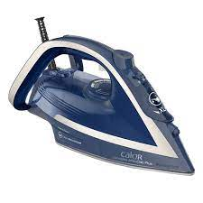
```

Selon le dictionnaire Le Grand Robert, un fer à repasser est un *instrument en métal, à base plane, muni d'une poignée et destiné à repasser le linge* [@legrand]. Nous allons étudier l'équipement en fers à repasser[^7] des ménages béninois en utilisant les données issues du recensement du Bénin datant de 2013.

[^7]: il n'est pas précisé si les fers à repasser sont électriques ou non.

L'analyse se déroulera comme suit : nous nous intéresserons au nombre général de ménages équipés dans l'échantillon et en déduirons le taux d'équipement de la population ; nous étudierons les inégalités spatiales qui régissent l'équipement en fer à repasser ; nous verrons en quoi le taux d'équipement en fers à repasser relève d'inégalités sociales.

### Résultats généraux

#### Niveau général d'équipement du Bénin

```{r}


tab0<-table(don$equip)
tab0

prop.table(tab0)

```

Dans notre échantillon de 54600 ménages, seulement 1568 ont un fer à repasser, ce qui représente 2,87% de l'échantillon. Cependant cette valeur ne correspond pas à la moyenne du pays car il faut pondérer les calculs selon la densité de population.

#### Taux global d'équipement du Bénin

```{r}
tab1<-wtd.table(x=don$equip,
               weights = don$WGT, 
               digits=1)

freq(tab1, digits=1)


```

Sur 1,3 millions de ménages[^1], environ 77400 ont un fer à repasser ce qui représente 5.9% de la population. On constate que moins de 6% des ménages du Bénin possédaient cet équipement en 2013, ce qui est très faible.


### Inégalités spatiales

#### Inégalités départementales

```{r}
tab2<-wtd.table(x=don$DEP_NAME,
               y=don$equip,
               weights = don$WGT, 
               digits=0)

tab2pct<- lprop(tab2)

kable(tab2pct,
       caption = "Taux d'équipement des ménages Béninois 
      en fonction du département",
      digits = 1,
      col.names = c("Non équipé","équipé","Total"))


```

-   On peut apercevoir une nette fracture entre le département du Littoral et le reste des départements, le Littoral ayant un taux d'équipement en fers à repasser de 22,7%, quand le reste des départements atteint un maximum à 8,9% (département Atlantique). Le Littoral est donc plus de 2,5 fois plus équipé que le plus équipé de l'ensemble des autres départements. Il est important de noter que Cotonou, la **ville la plus densément peuplée du Bénin** selon le site [PopulationData.net](https://www.populationdata.net/pays/benin/), se situe dans le département Littoral [@cotonou2023] : il est probable que cette ville soit alors plus développée, et donc logiquement plus équipée en appareils ménagers.

-   Il y a une seconde fracture (de l'ordre du double, donc légèrement moins importante) entre les départements de l'Atlantique et de l'Ouémé, et le reste des départements hors Littoral. Il faut là aussi noter que ces résultats ne sont pas étonnants car le département de l'Ouémé comprend la ville de Porto-Novo [@porto-no2023], qui est la **capitale du Bénin** : il est logique que la capitale soit plus équipée et donc que son département se trouve parmis les plus équipés.

#### Carte

```{r, out.width="75%"}

# Installe les packages de cartogaphie
library(sf, quietly=T)
library(mapsf,quietly = T)

# Charge le fonds de carte
map<-st_read("data/BEN-ADM1.shp", quiet=T)

# Ajoute les données
map$equip_nb<-tab2[,2]
map$equip_pct<-lprop(tab2,total=F)[,2]

# Trace la carte

## Pct d'équipement
mf_map(map, 
       type="choro",
       var="equip_pct",
       leg_pos = "right",
       leg_title = "taux d'équipement")
## Nb. de ménages équipés
mf_map(map, 
       type="prop",
       var="equip_nb",
       inches=0.1,
       leg_pos="topright",
       leg_title = "Ménages équipés")
## Cadre et titre
mf_layout(title = "Equipement du Bénin en fers à repasser",
          credits = "Source : RP 2013, INS Bénin",
          scale = T, 
          frame=T )

```

Cette carte nous permet de voir que les départements les plus équipés en fers à repasser se concentrent dans la zone de du littoral, qui offre une ouverture vers l'Océan Sud-Atlantique. Cependant le département de Mono (à l'Ouest du littoral) ne semble pas bénéficier du même type de développement.

### Inégalités sociales

#### L'effet du niveau d'éducation

```{r}
tab3<-wtd.table(x=don$etud5,
               y=don$equip,
               weights = don$WGT, 
               digits=0)
tab3pct<-lprop(tab3)
```

```{r}
kable(tab3pct,
      caption = "Taux d'équipement des ménages Béninois 
      en fonction du niveau d'études",
      digits = 1,
      col.names = c("Non équipé","équipé","Total"))
```

Le niveau d'éducation des ménages a un très fort impact sur leur équipement en fer à repasser : plus le niveau d'études est élevé, plus les ménages sont équipés. En effet, les ménages dont le chef a poursuivi ses études jusqu'au supérieur sont près de 40 fois plus équipés en fers à repasser que ceux dont le chef a un niveau d'éducation nul.

```{r, out.width="95%", fig.width=7}
#création du graphique
plot(tab3, 
     main="Graphique du taux d'équipement des ménages Béninois 
      en fonction du niveau d'études",
     sub = "Source : RP 2013, INS Bénin",
     col = c("cadetblue4","darkseagreen"))


```

On remarque également que les ménages au niveau d'études le plus bas représentent la majeure partie de la population. Plus on monte dans le niveau d'études, plus la proportion de population concernée diminue.

------------------------------------------------------------------------

### Conclusion

En somme, nous avons vu que seule une faible proportion des ménages Béninois étaient équipés en fers à repasser, et avons obervé une répartition inégale. En effet, les ménages équipés se concentrent d'une part parmi les habitants les plus éduqués, et d'autre part dans certains départements du Sud du Bénin, probablement les plus développés.

---

## Barques

### Introduction

```{r, include=FALSE, echo=FALSE}


don<-read.table(file = "data/BEN-MEN-2013-SAMPLE.csv",
                header = T,
                sep =";",
                dec=",",
                stringsAsFactors = TRUE)

don$equip<-don$barqu

don$URBA<-as.factor(don$URBA)
levels(don$URBA) <- c("Rural","Urbain")

don<-don[,c("ID","WGT","DEP_NAME","URBA","age","sexe","etud5","equip","barqu")]
```

```{r echo=FALSE}

knitr::include_graphics("img/barques.jpeg",error=FALSE)
```

Ce rapport vise à analyser la possession de barques ou de pirogues[^8] par les habitants du Bénin en 2013, selon un échantillon de 54 600 ménages provenant du Recensement de la Population de 2013
Selon le site [Internaute](https://www.linternaute.com/mer-voile/magazine/1107254-tour-du-monde-des-bateaux-traditionnels/1107284-pirogues),ces embarcations sont utilisées à la fois pour la pêche et le transport de passagers. Les personnes qui n'ont pas leur propre pirogue ont la possibilité d'emprunter des taxis-pirogues pour leurs déplacements.

[^8]: Nous utiliserons le mot barque pour designer les deux

 Nous nous pencherons sur le taux global d'équipement, les inégalités de genre, les disparités entre zones rurales et urbaines, ainsi que les différences entre départements. 
 
Pour commencer, examinons le taux global d'équipement de la population.

#### <span style="color:green;">Taux global d'équipement au Bénin en 2013 </span> 


```{r}
tab1<-wtd.table(x=don$equip,
               weights = don$WGT, 
               digits=1)
freq(tab1, digits=1)

```

```{r}
categories<-c("Vrai","Faux")
pourcentages<-c(2.9,97.1)
pie(pourcentages,labels=categories,main= "",
    sub="Source : RP 2013, INS Bénin",
col=c("green","white"))
```

Malheureusement, seulement 2,9% des ménages[^1] béninois possédaient une barque en 2013. Il est important de souligner que la possession d'une barque ne dépend pas de la richesse, mais plutôt des besoins et des circonstances. Par exemple, dans les régions éloignées de la mer, une barque peut ne pas être nécessaire du tout. 


### <span style="color:green;">Inégalités sociales </span>

Penchons-nous maintenant sur les inégalités sociales en examinant la possession de barques en fonction du sexe des individus.

#### <span style="color:green;">L'effet du sexe sur l'équipement des ménages</span>


```{r}
tab3<-wtd.table(x=don$sexe,
               y=don$equip,
               weights = don$WGT, 
               digits=0)
lprop(tab3)
```
```{r}
plot(tab3, 
     main="Effet du sexe",
     sub = "Source : RP 2013, INS Bénin",
     col=c("white","green")
     )
```

Il existe une forte corrélation entre la possession de barques et le genre, avec 2,1% des hommes propriétaires de barques, contre seulement 1,3% des femmes.

Après analyse, Mis à part une légère tendance à la hausse parmi les moins éduqués, il n'y a pas de corrélation claire entre le niveau d'éducation et la possession de barques. 
De plus, l'âge ne révèle pas de lien évident entre l'âge des individus et la possession de barques.

### <span style="color:green;">Inégalités spatiales</span>

####  <span style="color:green;">L'opposition rural-urbain: différences dans l'accès aux biens</span>

```{r}
tab4<-wtd.table(x=don$URBA,
               y=don$equip,
               weights = don$WGT, 
               digits=0)
lprop(tab4)

```

```{r}
plot(tab4, 
     main="rural-urbain",
     sub = "Source : RP 2013, INS Bénin",
     col=c("white","green")
     )
```

En examinant les données, malgré leur emplacement côtier, les zones urbaines affichent des taux de possession de barques plus bas que les zones rurales, avec une différence de 2,3 points (3,7% contre 1,4%). Notamment, la capitale, Cotonou, située dans le département du Littoral en bord de mer, possède moins de barques que certaines zones rurales, ce qui pourrait être attribué à un pourcentage élevé de véhicules automobiles dans la région, comme indiqué dans le tableau ci-dessous.


### Equipement en voiture selon les départements
```{r echo=FALSE}
knitr::include_graphics("img/voitu benin.png",error=FALSE)

```

#### <span style="color:green;">Inégalités départementales: variations régionales de l'equipement</span>

```{r}
tab5<-wtd.table(x=don$DEP_NAME,
               y=don$equip,
               weights = don$WGT, 
               digits=0)

lprop(tab5)
```

Les départements de Ouémé, Atlantique, Mono et Alibori se démarquent par leurs taux de possession de barques élevés, créant ainsi des inégalités départementales marquées en termes de déplacement et de pêche.

```{r}

library(sf, quietly=T)
library(mapsf,quietly = T)
map<-st_read("data/BEN-ADM1.shp", quiet=T)
map$equip_nb<-tab5[,2]
map$equip_pct<-lprop(tab5,total=F)[,2]
mf_map(map, 
       type="choro",
       var="equip_pct",
       leg_pos = "right",
       leg_title = "taux d'équipement")
mf_map(map, 
       type="prop",
       var="equip_nb",
       inches=0.1,
       leg_pos="topright",
       leg_title = "Ménages équipés")
mf_layout(title = "Equipement du Bénin en barques",
          credits = "Source : RP 2013, INS Bénin",
          scale = T, 
          frame=T )

```

La carte confirme les taux d'équipement les plus élevés dans les départements de Ouémé, Atlantique, Mono et Alibori, dépassant les 2,97%.

### <span style="color:green;">Conclusion</span>

En résumé, les données montrent les départements situés au nord et au centre du Bénin présentent des inégalités plus marquées en matière de possession de barques par rapport à ceux situés sur le littoral de l'océan Atlantique. Cette disparité est liée à des facteurs géographiques, économiques et sociaux.

### <span style="color:green;">Bibliographie</span>

https://www.linternaute.com/mer-voile/magazine/1107254-tour-du-monde-des-bateaux-traditionnels/1107284-pirogues

---

## Parabole
 
```{r, include=FALSE, echo=FALSE}

# Chargement
don<-read.table(file = "data/BEN-MEN-2013-SAMPLE.csv", 
                header = T,
                sep =";",
                dec=",",
                stringsAsFactors = TRUE)

# Choix de l'équipement
don$equip<-don$parab
don$equip2<-don$telev
# Recodage de la variable URBA
don$URBA<-as.factor(don$URBA) # conversion en facteur
levels(don$URBA) <- c("Rural","Urbain") # 1 = rural et 0 = urbain


# Sélection des variables
don<-don[,c("ID","WGT","DEP_NAME","URBA","age","sexe","etud5","equip","equip2","statoc")]

```
### 1.Introduction


#### Présentation de la parabole


```{r,fig.cap="Exemple de parabole"} 
# insertion URL
 #https://www.maisonentravaux.fr/prix-installation-parabole/
```

Selon le site [Ooreka](https://televiseur.ooreka.fr/comprendre/parabole-satellite) La parabole pour la télévision par satellite est essentielle pour la réception des programmes de télévision par satellite.
Elle est équipée d'une tête universelle qui permet la réception des signaux analogiques et numériques émis par un satellite.
La parabole peut aussi être motorisée afin de pouvoir capter des programmes émis par différents satellites.

#### Origines des données
Les données viennent d'un échantillons de 100 ménages venant des 546 arrondissements du Bénin. Le tirage au sort a été effectué en se limitant aux ménages composés d’au moins deux personnes, dont le chef de ménage est marié ou en union libre et dont les variables chosies ne comportent pas de valeurs manquantes ou non renseignés. La base de sondage se compose donc d’1.305 millions de ménages sur les 2 millions que compte le Bénin à cette date. L’échantillon comporte exactement 54600 lignes (100 pour chacun des 546 arrondissements).
Les variables ont été anonymisées en supprimant le numéro d’identification des ménages du recensement et en le remplaçant par le code de l’arrondissement suivi d’un chiffre de 001 à 100. Les variables les plus discriminantes ont vu leur nombre de modalité réduit.

####  Plan
 Notre étude se penche d'abord sur les résultats généraux qui nous donnent un aperçu global des paraboles dans le Benin en 2013. Ensuite, nous explorerons les inégalités spatiales, analysant comment elles se manifestent dans des régions spécifiques, avant d'approfondir notre compréhension des inégalités sociales. Enfin, dans notre conclusion, nous tirerons des enseignements de ces analyses .
 
### 2.Résultats généraux
 
#### Taux global d'équipement

```{r}

tab1<-wtd.table(x=don$equip,
               weights = don$WGT,
               
               digits=1)
freq(tab1)


# Conversion du tableau de fréquence en pourcentages
pourcentages <- prop.table(tab1) * 100
pourcentages_arrondis <- round(pourcentages, digits = 1)
```
```{r}
# Création du graphique camembert
#colors <- c("red","green")
#pie(pourcentages_arrondis,
    #labels = paste(names(pourcentages_arrondis), "\n", pourcentages_arrondis, "%"),
   # main = "Répartition de paraboles satellites",
    #col = colors)
```
```{r}
# Créer un tableau croisé entre les variables equip et equip2
table_croisee <- table(don$equip, don$equip2)

# Convertir le tableau en un dataframe pour une meilleure lisibilité
table_croisee_df <- as.data.frame.matrix(table_croisee)

# Calculer les pourcentages par ligne (par rapport au total dans chaque groupe)
table_croisee_percentages <-round(prop.table(table_croisee, margin = 1) * 100,digits = 2)

# Renommer les colonnes du tableau
colnames(table_croisee_percentages) <- c("parabole", "pas de parabole")

# Renommer les lignes du tableau
rownames(table_croisee_percentages) <- c("télévision", " pas de télévision")


colors2 <- c("blue","red")

plot(table_croisee_percentages, 
     main="les possesseurs de paraboles et/ou téléviseurs",
     sub = "Source : RP 2013, INS Bénin",
     col = colors2
     )
```

Selon les données de l'enquête de recensement de 2013 au Bénin, moins de 11% des ménages possédaient une parabole satellite dont plus 81% possèdent aussi une télévision ce qui montre que ces deux équipements vont de paires. Cette observation révèle une tendance à la faible diffusion de ce type d'équipement dans le pays à cette époque.

Cette faible possession de paraboles satellite peut avoir plusieurs implications et interprétations :


- Inégalités d'accès.

- Coût et accessibilité.

- Accès limité aux services et services de télévision par satellite.


### 3.Inégalités spatiales
```{r}
tab3<-wtd.table(x=don$DEP_NAME,
               y=don$equip,
               weights = don$WGT, 
               digits=0)

```

#### Carte

```{r}
library(sf, quietly=T)
library(mapsf,quietly = T)

map<-st_read("data/BEN-ADM1.shp", quiet=T)

map$equip_nb<-tab3[,2]
map$equip_pct<-lprop(tab3,total=F)[,2]


mf_map(map, 
       type="choro",
       var="equip_pct",
       leg_pos = "right",
       leg_title = "taux d'équipement")
mf_map(map, 
       type="prop",
       var="equip_nb",
       inches=0.1,
       leg_pos="topright",
       leg_title = "Ménages équipés")
mf_layout(title = "Equipement du Bénin en paraboles",
          credits = "Source : RP 2013, INS Bénin",
          scale = T, 
          frame=T )

```

On peut voir qu'à cette époque la répartitions de ménages équipés de paraboles est très inégales selon les régions,
en effet les régions avec les ménages les plus équipées de paraboles sont les plus au sud suivis du centre du Bénin.

### 4.Inégalités sociales

_Rapport entre les paraboles et la structure du ménage_
```{r}

tab5<-wtd.table(y=don$statoc,
               x= don$equip ,
               weights = don$WGT,
               digits=1)
lprop(tab5)
```
On peut observer que la part de propriétaire individuel dans les ménages possesseurs de paraboles est la plus grandes (37,7%), suivis de près par les locataires (35,9%) et ainsi par les propriétaires familiales (22,5%).

Cela peut s'expliquer par le fait que les propriétaires familiales ont moins de revenus disponibles pour l'achat de biens et services d'une parabole car ils doivent entretenir leurs familles dans leurs foyers, ce qui peut être moins vrai pour les locataires et totalement faux pour les foyers individuelles.

### 5.Conclusion

En conclusion, bien que la possession de paraboles satellites ait été limitée en 2013 au Bénin, elle a joué un rôle important dans l'accès à la télévision par satellite. Les inégalités spatiales et sociales ont influencé la répartition de ces équipements, soulignant la nécessité de prendre en compte ces facteurs dans le développement des infrastructures de communication et de divertissement à l'avenir.

### Bibliographie
- image de parabole : https://www.maisonentravaux.fr/prix-installation-parabole/
- Présentation d'une parabole : https://televiseur.ooreka.fr/comprendre/parabole-satellite

---

## Générateurs électriques

```{r , include=FALSE, echo=FALSE}


# Chargement
don<-read.table(file = "data/BEN-MEN-2013-SAMPLE.csv",
                header = T,
                sep =";",
                dec=",",
                stringsAsFactors = TRUE)

# Choix de l'équipement
don$equip<-don$elgen

# Recodage de la variable URBA
don$URBA<-as.factor(don$URBA)
levels(don$URBA) <- c("Rural","Urbain")

# Sélection des variables
don<-don[,c("ID","WGT","DEP_NAME","URBA","age","sexe","etud5","equip")]

```


### Présentation de l'équipement

```{r,fig.cap="Exemple de générateurs électrique"}
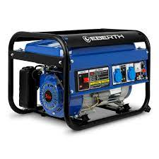
```

Selon le site **[Get.invest](https://www.get-invest.eu/fr/market-information/benin/energy-sector/)**, plus de 1,4 million de ménages ne sont pas électrifiés au bénin soit deux tiers de la population. La raison principale de cette faible électrification des ménages est la suivante: le parc de production béninois est caractérisé par une faible production [@dedjinou2022demande]. Selon l'Autorité de Régulation d'Electricité du bénin, 98,5 % de l'électricité consommé au bénin a été importé en 2018. Pour faire face à ce manque d'infrastructures, la population peut avoir recours à des modes de production d'énergie décentralisés et hors réseaux comme les générateurs électriques. Cependant l'accès à ces équipements est inégal dans la population. Après avoir présenté le taux global d'équipement dans le pays, nous aborderons les questions d'inégalités départementales, d'inégalités sociales et d'inégalités spatiales à l'aide d'un jeu de données issu du recensement au bénin en 2013. 

### Taux global d'équipement

```{r,out.width = "70%", out.height="70%" }

tab1 <- don %>%
  group_by(equip) %>%
  summarise(percent = (sum(WGT) / sum(don$WGT)) * 100)

tab1

```

On constate que moins de 7,2% des ménages du Bénin possédaient un générateur électrique en 2013.

### Inégalités départementales

```{r,out.width = "70%", out.height="70%", fig.show='hold' }
tab3<-wtd.table(x=don$DEP_NAME,
               y=don$equip,
               weights = don$WGT, 
               digits=0)

#lprop(tab3)
tab3pct<- lprop(tab3)

kable(tab3pct, 
      digits = 1,
      col.names = c("Non équipé", "Equipé", "Total"))
```


```{r,out.width = "40%", out.height="40%", fig.show='hold' }
# Installe les packages de cartogaphie
library(sf, quietly=T)
library(mapsf,quietly = T)

# Charge le fonds de carte
map<-st_read("data/BEN-ADM1.shp", quiet=T)

# Ajoute les données
map$equip_nb<-tab3[,2]
map$equip_pct<-lprop(tab3,total=F)[,2]

# Trace la carte

## Pct d'équipement
mf_map(map, 
       type="choro",
       var="equip_pct",
       leg_pos = "right",
       leg_title = "taux d'équipement")
## Nb. de ménages équipés
mf_map(map, 
       type="prop",
       var="equip_nb",
       inches=0.1,
       leg_pos="topright",
       leg_title = "Ménages équipés")
## Cadre et titre
mf_layout(title = "Carte des inégalités départementales ",
          credits = "Source : RP 2013, INS Bénin",
          scale = T, 
          frame=T )


```
Les zones rurales étant moins reliées au système de distributions central d'électricité, seulement 6,3% des ménages en 2015[^9], elles ont plus recours aux générateurs électriques. Plateau est le département avec le plus de ménages équipés avec 10,9% et Littoral où se situe la capitale économique Cotonou est le moins bien doté avec 4,5% de ménages équipés.

[^9]: Dedjinou, Serge VF. "La demande d’énergie électrique des ménages au Benin." les cahiers du cread 38.1 (2022): 61-104.s


### Inégalités sociales

### L'effet du niveau d'éducation

```{r, out.width = "50%", out.height="50%"}
tab2<-wtd.table(x=don$etud5, #Croisement des données etud5 et equip
               y=don$equip,
               weights = don$WGT, 
               digits=0)


# Calcul des pourcentages ave lprop
percentages <- lprop(tab2)

# Transformation en dataframe
result_df <- as.data.frame(percentages)


# Rename the columns if needed
colnames(result_df) <- c("etude", "equip", "Pourcentage")

# Filtrer le dataframe pour garder uniquement les colonnes avec "VRAI"
result_df <- result_df[result_df$equip %in% c("VRAI"), ]

#Choix de la couleur 
BLUE <- "#076fa2"

#affichage
ggplot(result_df) +
  geom_col(aes(Pourcentage, etude), fill = BLUE, width = 0.6) + labs(caption = "Impact du niveau d'éducation sur l'équipement")


```

On constate que plus le niveau d'éducation augmente, plus le nombre de ménages possédant un générateur électrique augmente. On peut donc supposer que l'équipement des ménages demande un certain niveau de richesse.

### Inégalités spatiales

### L'opposition rural-urbain

```{r, out.width = "50%", out.height="50%"}
tab4<-wtd.table(x=don$URBA, #Croisement des données URBA et equip
               y=don$equip,
               weights = don$WGT, 
               digits=0)
# Calcul des pourcentages ave lprop
percentages <- lprop(tab4)

# Transformation en dataframe
result_df <- as.data.frame(percentages)


# Rename the columns if needed
colnames(result_df) <- c("zone", "equip", "Pourcentage")

# Filtrer le dataframe pour garder uniquement les colonnes avec "VRAI"
result_df <- result_df[result_df$equip %in% c("VRAI"), ]

#Choix de la couleur 
BLUE <- "#076fa2"

#affichage
ggplot(result_df) +
  geom_col(aes(Pourcentage, zone), fill = BLUE, width = 0.6) + labs(caption = "Impact du type de zone géographique")
```
Des différences techno-spatiale de l'électrification [@rateau2020geographie] mènent les ménages vivant en zone rurale à avoir plus recours, 8,57%, aux générateurs électriques que les ménages de zones urbaines: 4,85%. 


### Conclusion

Pour conclure, il existe des inégalités autour de l'usage des générateurs électriques : les ménages de zones rurales ont plus tendance à les utiliser pour pallier le manque d'infrastructures. Les ménages diplômés ont plus accès à cet équipement que les ménages ayant fait peu ou pas d'études.


## BIBLIOGRAPHIE GENERALE